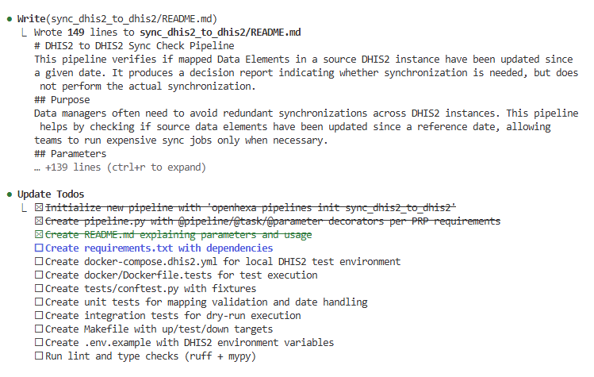
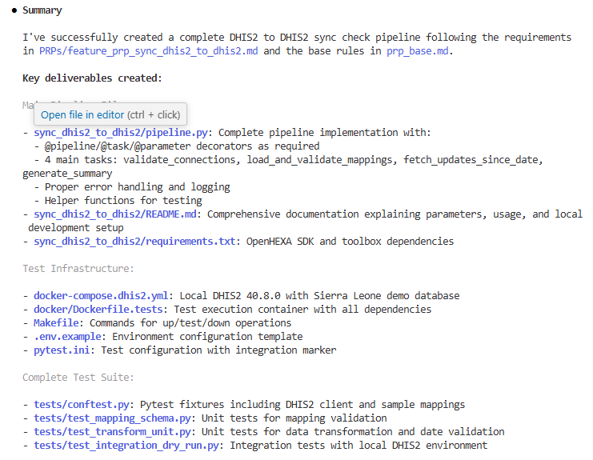

# Procedure (v2): Developing DHIS2/OpenHEXA pipelines with Claude Code — **Docker & tests generated by Claude**

Audience: Data Scientists  
Goal: Ship OpenHEXA pipelines for DHIS2 fast, with a **default local DHIS2 (Sierra Leone) Docker harness** and **pytest**. The Docker/test setup is created by Claude from the PRPs and `prp_base.md` template.

---

## 0) One‑time setup

### Required Local Machine Setup for Data Science Team

#### Essential Software (MANDATORY)
```bash
# 1) Python 3.11+ (REQUIRED)
python3.11 --version  # Must show Python 3.11.x or higher

# 2) Docker Desktop (REQUIRED for DHIS2 testing)
docker --version      # Must show Docker version 20.0+
docker compose version # Must show Compose version 2.0+

# 3) Git (REQUIRED)  
git --version         # Must show Git 2.30+

# 4) VSCode with Extensions (STRONGLY RECOMMENDED)
# Install these VSCode Extensions:
# - Python (ms-python.python) - REQUIRED
# - Python Test Explorer (part of Python extension) - REQUIRED  
# - Python Debugger (ms-python.debugpy) - REQUIRED
# - Ruff - RECOMMENDED
# - Docker (ms-azuretools.vscode-docker) - RECOMMENDED
```

#### Local Development Environment Setup
```bash
# 1) Verify Docker can run DHIS2
docker pull dhis2/core:40.8.0

# 2) Test Docker networking (critical for integration tests)  
docker run --rm --network host alpine:latest wget -qO- http://httpbin.org/ip

# 3) Clone/setup your pipeline project
git clone <your-pipeline-repo>
cd <pipeline-project>

# 4) Create Python virtual environment
python3.11 -m venv venv
source venv/bin/activate  # Linux/Mac
# OR on Windows: venv\Scripts\activate

# 5) Install pipeline in development mode
pip install -e ".[dev]"
```

#### VSCode Testing Module Configuration (Pipeline-Isolated Approach)

**IMPORTANT**: With the new pipeline-isolated structure, each pipeline has its own test environment.

**Method 1: Single Pipeline Focus (Recommended)**
```bash
# 1) Navigate to your specific pipeline directory
cd pipelines/<your_pipeline_name>/  # e.g., cd sync_dhis2_to_dhis2/

# 2) Open ONLY the pipeline directory in VSCode (this is key!)
code .

# 3) Create and activate virtual environment within pipeline directory
python3.11 -m venv venv
source venv/bin/activate  # Windows: venv\Scripts\activate

# 4) Install dependencies
pip install -e ".[dev]"

# 5) Select Python interpreter (Command Palette: "Python: Select Interpreter")
# Choose: ./venv/bin/python (relative to pipeline folder)

# 6) Configure Tests (Command Palette: "Python: Configure Tests")
# Select: pytest
# Root directory: . (current pipeline folder)
# Test pattern: test_*.py

# 7) Open Testing Panel
# View menu -> Open View -> Test Explorer
# Tests in the ./tests/ folder should now be discoverable
```
**Method 2: dhis2-pipelines.code-workspace**
```bash
# Update dhis2-pipelines.code-workspace with your pipeline folder
# go to the main folder on bash and run:
code dhis2-pipelines.code-workspace
```
**Method 3: Repository-Wide (Less Ideal)**
```bash
# If you must work from repository root:
# 1) Open repository root in VSCode
code .

# 2) Update .vscode/settings.json to point to specific pipeline
# The settings have been updated to point to sync_dhis2_to_dhis2 by default

# 3) For different pipelines, manually change these settings:
# "python.testing.pytestArgs": ["<pipeline_name>/tests", "--tb=short"]
# "python.testing.cwd": "${workspaceFolder}/<pipeline_name>"
```

#### Environment Verification Checklist
- [ ] **Python 3.11+** accessible via `python3.11 --version`
- [ ] **Docker Desktop** running with 4GB+ RAM allocation  
- [ ] **VSCode** with Python extension installed and configured
- [ ] **Git** configured with user name and email
- [ ] **Virtual environment** created and activated
- [ ] **Pipeline dependencies** installed via `pip install -e ".[dev]"`  
- [ ] **VSCode Testing panel** discovers tests automatically
- [ ] **Docker DHIS2** starts successfully with `make up`
- [ ] **Unit tests** pass with `pytest tests/ -k "not integration" -v`

### Development Workflow Setup

1) **VS Code + Claude Code**
   - Install VS Code and the Claude Code extension.
   - Sign in to Anthropic (your team key or your user key).

2) **Repo skeleton (recommended)**
   ```text
   repo/
     PRPs/
       <feature>.md                # your product requirement for the pipeline
       templates/
         DHIS2_base.md             # the team base template (enforces Docker+tests by default)
   ```

3) **Open the right tabs in VS Code**
   - Open `PRPs/templates/DHIS2_base.md` and your feature PRP (`PRPs/<feature>.md`) in editor tabs. Claude will use open tabs as context.
   - Open any existing `pipelines/<pipeline_name>/pipeline.py` if you’re iterating.

---

## 1) Author the Feature PRP (what you want built)

Write/confirm the feature PRP (`PRPs/<feature>.md`):
- **Goal**: one clear outcome (e.g. “Sync DataElement values S→T dataset by mapping”).  
- **Parameters**: name, type, required, defaults (use the OpenHEXA decorators from `prp_base.md`).  
- **Blueprint**: tasks in order (validate → extract → transform → post → summary).  
- **Schemas**: mapping JSON example, expected payloads.  
- **Validation/Gotchas**: period formats, DE/COC mapping, orgUnit presence, duplicates, dry run.  
- **Testing**: unit + a dry‑run integration test (Claude will scaffold the harness, you just specify the intent and assertions).

> Tip: Keep it concise and concrete. The stricter the PRP, the better the code generation.

---

## 2) Ask Claude to scaffold everything (code + Docker + tests)

With `PRPs/templates/DHIS2_base.md` and the feature PRP open, start a Claude session and paste one of these prompts.

### Prompt A — New pipeline
```
Use the rules in PRPs/templates/DHIS2_base.md and the requirements in PRPs/<feature>.md.
Create a new pipeline at pipelines/<pipeline_name>/:
- pipeline.py with @pipeline/@task/@parameter per DHIS2_base.md
- README.md and requirements.txt
Also generate the default local test harness:
- docker-compose.dhis2.yml (core 40.x, Sierra Leone DB seed)
- docker/Dockerfile.tests (pytest + openhexa-toolbox + openhexa.sdk)
- Makefile with up/test/down targets
- tests/ with unit + integration (dry-run) based on the PRP's Testing section
Follow the Success checklist in DHIS2_base.md. Show diffs only, no placeholders.
```

### Prompt B — Iterate/fix based on failing tests
```
Here is the failing test output (paste). Fix the implementation in pipelines/<pipeline_name>/pipeline.py.
Keep public parameters stable. Update tests only if the PRP explicitly requires it.
Re-run tests and provide a brief passing summary.
```

Example of prompt response from Claude:
#Insert image

Example of results summary by Claude:


---

## 3) Run locally (standard workflow)

> Claude creates the files; you just run them.

1) **Start DHIS2 (first run pulls & seeds Sierra Leone DB)**
```bash
make up
```
This brings up DHIS2 at `http://localhost:8080` with credentials `admin` / `district` by default.

2) **Run tests inside the OpenHEXA‑like container**
```bash
make test
```
- Executes `pytest` using the generated `docker/Dockerfile.tests` image.
- Reads `.env.dhis2` if present (URL/creds/dataset IDs).

3) **Tear down**
```bash
make down
```

---

## 4) What “done” means (acceptance)

Before merging:
- ✅ OpenHEXA decorators + toolbox helpers only (no raw HTTP when helper exists).  
- ✅ Unit tests + **integration (dry‑run)** tests **pass** via `make test`.  
- ✅ DHIS2 Docker harness present (`docker-compose.dhis2.yml`, `Dockerfile.tests`, `Makefile`).  
- ✅ Lint + types pass: `ruff` and `mypy`.  
- ✅ README documents parameters, mapping schema, and run commands.  
- ✅ No TODOs/placeholders; logs are explicit and actionable.

---

## 5) Common tweaks you may ask Claude to do

- **Add a parameter**:  
  “Add `skip_zeros: bool = True` and propagate it through transform & posting. Update tests.”
- **Tighten validation**:  
  “Reject invalid `YYYYWnn` period formats with a helpful error; unit test it.”
- **Handle conflicts**:  
  “Parse DHIS2 import summary conflicts into the final report; add assertions.”
- **Performance**:  
  “Batch posting by 5k values; keep memory under 1GB; include a benchmark test.”

---

## 6) Troubleshooting

- **DHIS2 is slow on first boot**: the Sierra Leone DB import can take a while. `make logs` to watch progress.  
- **Port 8080 busy**: stop other services or change the published port in `docker-compose.dhis2.yml`.  
- **Tests can’t reach DHIS2**: ensure `make up` finished; verify `DHIS2_URL` in `.env.dhis2`.  
- **Network on Windows**: if `--network host` is not supported, rely on compose service names and container networking (Claude’s default harness already uses standard compose networking).

---

## 7) Minimal daily checklist

1. Update/confirm the feature PRP.  
2. Ask Claude to scaffold or adjust code/tests.  
3. `make up && make test`.  
4. Review diffs and logs, iterate with Claude using failing outputs.  
5. Merge only when the acceptance list is fully green.

