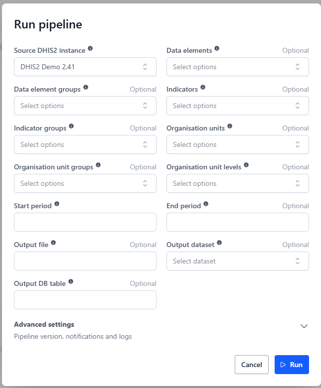
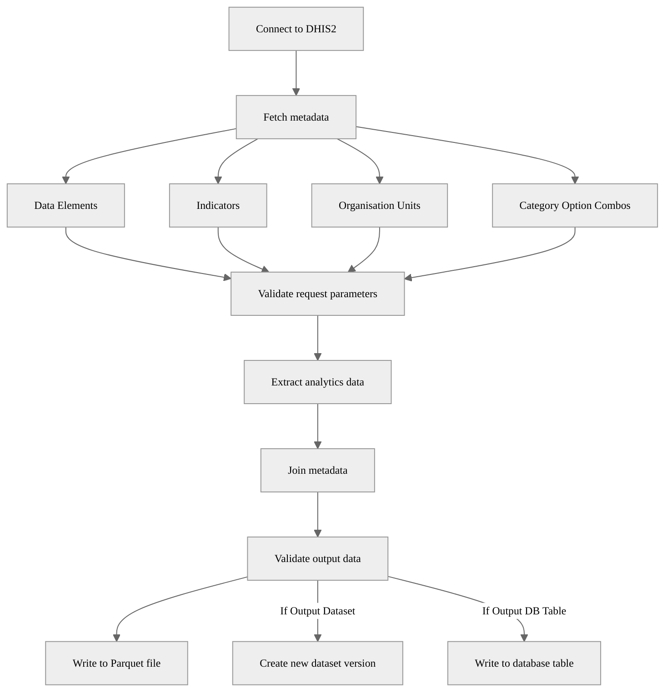

# DHIS2 Analytics Extraction Pipeline

## Description

This pipeline extracts analytics data from a DHIS2 instance, including data elements, data element groups, indicators and indicator groups; including their associated metadata. The extracted data is processed and saved as a Parquet file for further analysis and optionally into a dataset and a database. 

## Example usage



## Parameters

| Parameter | Type | Required | Default | Description |
|-----------|------|----------|---------|-------------|
| Source DHIS2 instance | DHIS2 Connection | Yes | - | The DHIS2 instance to extract data from |
| Data elements | List of String | No | - | Data elements to extract |
| Data element groups | List of String | No | - | Data element groups to extract |
| Indicators | List of String | No | - | Indicators to extract |
| Indicator groups | List of String | No | - | Indicator groups to extract |
| Organisation units | List of String | No | - | Organisation units to include |
| Organisation unit groups | List of String | No | - | Organisation unit groups to include |
| Organisation unit levels | List of String | No | - | Organisation unit levels to include |
| Start period | String | Yes | - | Start period for the extraction (DHIS2 format) |
| End period | String | No | Current period | End period for the extraction (DHIS2 format) |
| Output file | String | No | Auto-generated | Custom output file path in workspace |
| Output dataset | Dataset | No | - | OpenHEXA dataset. A new version will be created if new content is detected |
| Output DB table | String | No | - | Database table name for storing the extracted data |

⚠️

A valid DHIS2 analytics request is composed of *one unit of information for each dimension*:

* Data dimension (what?): Data elements, Data element groups, Indicators, **or** Indicator groups.
* Spatial dimension (where?): Organisation units, Organisation unit groups, **or** Organisation unit levels.
* Temporal dimension (when?): Start period, End period.

Multiple parameters per dimension are not allowed. For example, you cannot specify both data elements and data element groups, or both organisation unit groups and organisation unit levels.

## Output

The pipeline supports three output options that can be used individually or in combination:

### 1. File Output (Parquet)
The pipeline generates a Parquet file containing the extracted analytics data with enriched metadata. 

- If the parameter `Output file` is not provided, the file is saved to:
```
<workspace>/pipelines/dhis2_extract_analytics/<timestamp>/data_values.parquet
```

- If the parameter `Output file` is provided, the file is saved to the specified path. 


### 2. OpenHEXA Dataset
When an `Output dataset` is specified, the pipeline will:
- Check if the data has changed compared to the latest dataset version
- Create a new version (v1, v2, v3, etc.) only if new content is detected
- Skip versioning if the data is unchanged

### 3. Database Table
When an `Output DB table` name is provided, the extracted data will be written directly to the workspace database, replacing any existing table with the same name.

### Output Data Structure
The output includes:
- Data values for selected data elements or indicators
- Periods
- Organisation unit details and hierarchy information
- Category option combo details (where applicable)
- Human-readable names for all IDs

```
┌──────────────┬───────────────────────────────────────┬──────────────────────┬────────┬───────┬─────────────┬─────────────┬─────────────┬─────────────┬──────────────┬──────────────┬──────────────┬─────────────────┐
│ indicator_id ┆ indicator_name                        ┆ organisation_unit_id ┆ period ┆ value ┆ level_1_id  ┆ level_2_id  ┆ level_3_id  ┆ level_4_id  ┆ level_1_name ┆ level_2_name ┆ level_3_name ┆ level_4_name    │
│ ---          ┆ ---                                   ┆ ---                  ┆ ---    ┆ ---   ┆ ---         ┆ ---         ┆ ---         ┆ ---         ┆ ---          ┆ ---          ┆ ---          ┆ ---             │
│ str          ┆ str                                   ┆ str                  ┆ str    ┆ str   ┆ str         ┆ str         ┆ str         ┆ str         ┆ str          ┆ str          ┆ str          ┆ str             │
╞══════════════╪═══════════════════════════════════════╪══════════════════════╪════════╪═══════╪═════════════╪═════════════╪═════════════╪═════════════╪══════════════╪══════════════╪══════════════╪═════════════════╡
│ iCBpPh3ehjg  ┆ BCG Coverage - Adjusted for reporting ┆ lQIe6vtSe1P          ┆ 2021   ┆ 0.0   ┆ ImspTQPwCqd ┆ Vth0fbpFcsO ┆ TQkG0sX9nca ┆ lQIe6vtSe1P ┆ Sierra Leone ┆ Kono         ┆ Gbense       ┆ Gbangadu MCHP   │
│ iCBpPh3ehjg  ┆ BCG Coverage - Adjusted for reporting ┆ xMn4Wki9doK          ┆ 2021   ┆ 0.0   ┆ ImspTQPwCqd ┆ lc3eMKXaEfw ┆ XEyIRFd9pct ┆ xMn4Wki9doK ┆ Sierra Leone ┆ Bonthe       ┆ Imperi       ┆ Moriba Town CHC │
│ iCBpPh3ehjg  ┆ BCG Coverage - Adjusted for reporting ┆ lQIe6vtSe1P          ┆ 2022   ┆ 0.0   ┆ ImspTQPwCqd ┆ Vth0fbpFcsO ┆ TQkG0sX9nca ┆ lQIe6vtSe1P ┆ Sierra Leone ┆ Kono         ┆ Gbense       ┆ Gbangadu MCHP   │
│ iCBpPh3ehjg  ┆ BCG Coverage - Adjusted for reporting ┆ xMn4Wki9doK          ┆ 2022   ┆ 0.0   ┆ ImspTQPwCqd ┆ lc3eMKXaEfw ┆ XEyIRFd9pct ┆ xMn4Wki9doK ┆ Sierra Leone ┆ Bonthe       ┆ Imperi       ┆ Moriba Town CHC │
│ iCBpPh3ehjg  ┆ BCG Coverage - Adjusted for reporting ┆ lQIe6vtSe1P          ┆ 2023   ┆ 0.0   ┆ ImspTQPwCqd ┆ Vth0fbpFcsO ┆ TQkG0sX9nca ┆ lQIe6vtSe1P ┆ Sierra Leone ┆ Kono         ┆ Gbense       ┆ Gbangadu MCHP   │
│ …            ┆ …                                     ┆ …                    ┆ …      ┆ …     ┆ …           ┆ …           ┆ …           ┆ …           ┆ …            ┆ …            ┆ …            ┆ …               │
│ iCBpPh3ehjg  ┆ BCG Coverage - Adjusted for reporting ┆ lQIe6vtSe1P          ┆ 2024   ┆ 0.0   ┆ ImspTQPwCqd ┆ Vth0fbpFcsO ┆ TQkG0sX9nca ┆ lQIe6vtSe1P ┆ Sierra Leone ┆ Kono         ┆ Gbense       ┆ Gbangadu MCHP   │
│ iCBpPh3ehjg  ┆ BCG Coverage - Adjusted for reporting ┆ xMn4Wki9doK          ┆ 2024   ┆ 85.61 ┆ ImspTQPwCqd ┆ lc3eMKXaEfw ┆ XEyIRFd9pct ┆ xMn4Wki9doK ┆ Sierra Leone ┆ Bonthe       ┆ Imperi       ┆ Moriba Town CHC │
│ bASXd9ukRGD  ┆ OPV Stock PHU                         ┆ lQIe6vtSe1P          ┆ 2024   ┆ 143.0 ┆ ImspTQPwCqd ┆ Vth0fbpFcsO ┆ TQkG0sX9nca ┆ lQIe6vtSe1P ┆ Sierra Leone ┆ Kono         ┆ Gbense       ┆ Gbangadu MCHP   │
│ bASXd9ukRGD  ┆ OPV Stock PHU                         ┆ MBtmOhLs7y1          ┆ 2024   ┆ 13.0  ┆ ImspTQPwCqd ┆ bL4ooGhyHRQ ┆ d9iMR1MpuIO ┆ MBtmOhLs7y1 ┆ Sierra Leone ┆ Pujehun      ┆ Soro-Gbeima  ┆ Sengama MCHP    │
│ bASXd9ukRGD  ┆ OPV Stock PHU                         ┆ xMn4Wki9doK          ┆ 2024   ┆ 329.0 ┆ ImspTQPwCqd ┆ lc3eMKXaEfw ┆ XEyIRFd9pct ┆ xMn4Wki9doK ┆ Sierra Leone ┆ Bonthe       ┆ Imperi       ┆ Moriba Town CHC │
└──────────────┴───────────────────────────────────────┴──────────────────────┴────────┴───────┴─────────────┴─────────────┴─────────────┴─────────────┴──────────────┴──────────────┴──────────────┴─────────────────┘
```

## Validation

The output data is validated; checking that:
- The DataFrame is not empty
- All required columns are present
- Columns have the expected data types
- Certain columns have no null values
If the validation fails, the pipeline raises an error and stops execution.

## Pipeline Flow


