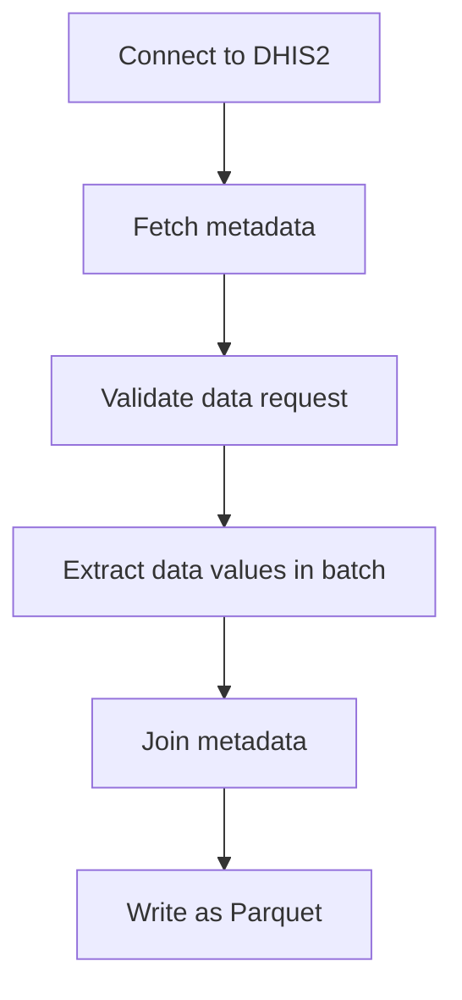

# DHIS2 Data Elements Extraction Pipeline

## Description

This pipeline extracts data values for specified data elements from a DHIS2 instance, processes the data, and saves it as a Parquet file.


## Parameters

| Parameter | Type | Required | Default | Description |
|-----------|------|----------|---------|-------------|
| Source DHIS2 | DHIS2 Connection | Yes | - | Source DHIS2 instance to extract data from |
| Data elements | List of String | Yes | - | Data elements to extract |
| Organisation units | List of String | No | - | IDs of organisation units to extract data from |
| Organisation unit groups | List of String | No | - | IDs of organisation unit groups to extract data from |
| Include children | Boolean | No | `False` | Whether to include children of the selected organisation units |
| Start date | String | Yes | `2020-01-01` | Start date for the extraction (YYYY-MM-DD) |
| End date | String | No | - | End date for the extraction (today by default) |
| Output file | String | No | - | Custom output file path in workspace (default: auto-generated) |

## Output

The pipeline generates a Parquet file containing the extracted data values with enriched metadata. By default, the file is saved to:

```
<workspace>/pipelines/dhis2_extract_data_elements/<timestamp>/data_values.parquet
```

The output includes:
- DHIS2 data values for the specified data elements
- Periods
- Data element names
- Organisation unit names and hierarchy information
- Category option combo names

## Pipeline Flow


