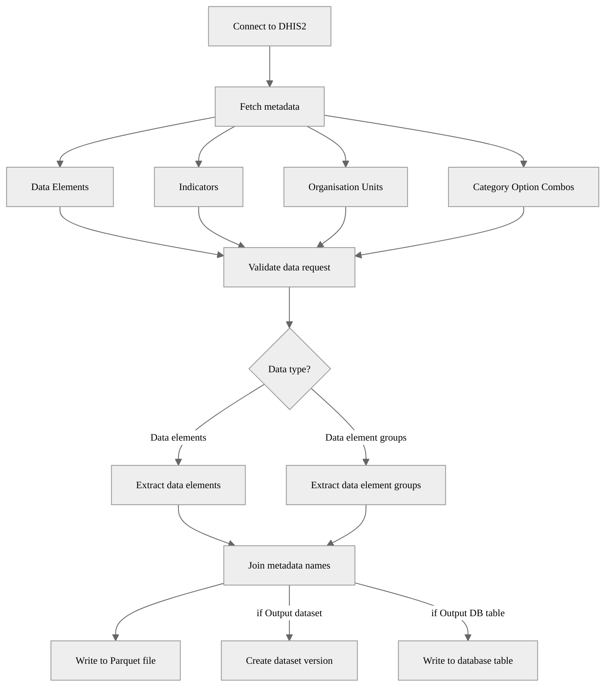

# DHIS2 Data Elements Extraction Pipeline

## Description

This pipeline extracts data values from a DHIS2 instance for specified data elements or data element groups; organisation units or organisation unit groups and periods. It processes the data, adding the relevant metadata. It saves it as a Parquet file and optionally into a dataset and a database

## Example usage


## Parameters

| Parameter | Type | Required | Default | Description |
|-----------|------|----------|---------|-------------|
| Source DHIS2 | DHIS2 Connection | Yes | - | Source DHIS2 instance to extract data from |
| Data elements | List of String | No | - | Data elements to extract |
| Data element groups | List of String | No | - | Data element groups to extract |
| Organisation units | List of String | No | - | IDs of organisation units to extract data from |
| Organisation unit groups | List of String | No | - | IDs of organisation unit groups to extract data from |
| Include children | Boolean | No | `False` | Whether to include children of the selected organisation units |
| Start date | String | Yes | `2020-01-01` | Start date for the extraction (YYYY-MM-DD) |
| End date | String | No | Today | End date for the extraction (YYYY-MM-DD) |
| Output file | String | No | Auto-generated | Custom output file path in workspace |
| Output dataset | Dataset | No | - | OpenHEXA dataset. A new version will be created if new content is detected |
| Output DB table | String | No | - | Database table name for storing the extracted data |

⚠️

A valid DHIS2 data extraction request is composed of *one unit of information for each dimension*:

* Data dimension (what?): Data elements **or** Data element groups
* Spatial dimension (where?): Organisation units **or** Organisation unit groups (at least one required)
* Temporal dimension (when?): Start date, End date

## Output

The pipeline supports three output options that can be used individually or in combination:

### 1. File Output (Parquet)
The pipeline generates a Parquet file containing the extracted analytics data with enriched metadata. 

- If the parameter `Output file` is not provided, the file is saved to:
```
<workspace>/pipelines/dhis2_extract_data_elements/<timestamp>/data_values.parquet
```

- If the parameter `Output file` is provided, the file is saved to the specified path. 

### 2. OpenHEXA Dataset
When an `Output dataset` is specified, the pipeline will:
- Check if the data has changed compared to the latest dataset version
- Create a new version (v1, v2, v3, etc.) only if new content is detected
- Skip versioning if the data is unchanged

### 3. Database Table
When an `Output DB table` name is provided, the extracted data will be written directly to the workspace database, replacing any existing table with the same name.

### Output Data Structure
The output includes:
- DHIS2 data values for the specified data elements
- Periods
- Data element names
- Organisation unit names and hierarchy information
- Category option combo names

```
┌─────────────────┬───────────────────┬──────────────────────┬──────────────────────────┬────────────────────────────┬───────────────────────────┬────────┬───────┬─────────────┬─────────────┬─────────────┬─────────────┬──────────────┬──────────────┬──────────────┬──────────────┬─────────────────────────┬─────────────────────────┐
│ data_element_id ┆ data_element_name ┆ organisation_unit_id ┆ category_option_combo_id ┆ category_option_combo_name ┆ attribute_option_combo_id ┆ period ┆ value ┆ level_1_id  ┆ level_2_id  ┆ level_3_id  ┆ level_4_id  ┆ level_1_name ┆ level_2_name ┆ level_3_name ┆ level_4_name ┆ created                 ┆ last_updated            │
│ ---             ┆ ---               ┆ ---                  ┆ ---                      ┆ ---                        ┆ ---                       ┆ ---    ┆ ---   ┆ ---         ┆ ---         ┆ ---         ┆ ---         ┆ ---          ┆ ---          ┆ ---          ┆ ---          ┆ ---                     ┆ ---                     │
│ str             ┆ str               ┆ str                  ┆ str                      ┆ str                        ┆ str                       ┆ str    ┆ str   ┆ str         ┆ str         ┆ str         ┆ str         ┆ str          ┆ str          ┆ str          ┆ str          ┆ datetime[ms, UTC]       ┆ datetime[ms, UTC]       │
╞═════════════════╪═══════════════════╪══════════════════════╪══════════════════════════╪════════════════════════════╪═══════════════════════════╪════════╪═══════╪═════════════╪═════════════╪═════════════╪═════════════╪══════════════╪══════════════╪══════════════╪══════════════╪═════════════════════════╪═════════════════════════╡
│ pikOziyCXbM     ┆ OPV1 doses given  ┆ vELbGdEphPd          ┆ Prlt0C1RF0s              ┆ Fixed, <1y                 ┆ HllvX50cXC0               ┆ 202001 ┆ 25    ┆ ImspTQPwCqd ┆ O6uvpzGd5pu ┆ zFDYIgyGmXG ┆ vELbGdEphPd ┆ Sierra Leone ┆ Bo           ┆ Bargbo       ┆ Jimmi CHC    ┆ 2022-09-05 13:06:21 UTC ┆ 2010-02-27 00:00:00 UTC │
│ pikOziyCXbM     ┆ OPV1 doses given  ┆ vELbGdEphPd          ┆ V6L425pT3A0              ┆ Outreach, <1y              ┆ HllvX50cXC0               ┆ 202002 ┆ 13    ┆ ImspTQPwCqd ┆ O6uvpzGd5pu ┆ zFDYIgyGmXG ┆ vELbGdEphPd ┆ Sierra Leone ┆ Bo           ┆ Bargbo       ┆ Jimmi CHC    ┆ 2022-09-05 13:06:21 UTC ┆ 2010-05-10 00:00:00 UTC │
│ pikOziyCXbM     ┆ OPV1 doses given  ┆ vELbGdEphPd          ┆ Prlt0C1RF0s              ┆ Fixed, <1y                 ┆ HllvX50cXC0               ┆ 202002 ┆ 26    ┆ ImspTQPwCqd ┆ O6uvpzGd5pu ┆ zFDYIgyGmXG ┆ vELbGdEphPd ┆ Sierra Leone ┆ Bo           ┆ Bargbo       ┆ Jimmi CHC    ┆ 2022-09-05 13:06:21 UTC ┆ 2010-05-10 00:00:00 UTC │
│ pikOziyCXbM     ┆ OPV1 doses given  ┆ vELbGdEphPd          ┆ Prlt0C1RF0s              ┆ Fixed, <1y                 ┆ HllvX50cXC0               ┆ 202004 ┆ 38    ┆ ImspTQPwCqd ┆ O6uvpzGd5pu ┆ zFDYIgyGmXG ┆ vELbGdEphPd ┆ Sierra Leone ┆ Bo           ┆ Bargbo       ┆ Jimmi CHC    ┆ 2022-09-05 13:06:21 UTC ┆ 2010-05-27 00:00:00 UTC │
│ pikOziyCXbM     ┆ OPV1 doses given  ┆ vELbGdEphPd          ┆ Prlt0C1RF0s              ┆ Fixed, <1y                 ┆ HllvX50cXC0               ┆ 202003 ┆ 44    ┆ ImspTQPwCqd ┆ O6uvpzGd5pu ┆ zFDYIgyGmXG ┆ vELbGdEphPd ┆ Sierra Leone ┆ Bo           ┆ Bargbo       ┆ Jimmi CHC    ┆ 2022-09-05 13:06:21 UTC ┆ 2010-05-28 00:00:00 UTC │
│ …               ┆ …                 ┆ …                    ┆ …                        ┆ …                          ┆ …                         ┆ …      ┆ …     ┆ …           ┆ …           ┆ …           ┆ …           ┆ …            ┆ …            ┆ …            ┆ …            ┆ …                       ┆ …                       │
│ pikOziyCXbM     ┆ OPV1 doses given  ┆ vELbGdEphPd          ┆ Prlt0C1RF0s              ┆ Fixed, <1y                 ┆ HllvX50cXC0               ┆ 202503 ┆ 30    ┆ ImspTQPwCqd ┆ O6uvpzGd5pu ┆ zFDYIgyGmXG ┆ vELbGdEphPd ┆ Sierra Leone ┆ Bo           ┆ Bargbo       ┆ Jimmi CHC    ┆ 2022-09-05 12:45:50 UTC ┆ 2010-05-27 00:00:00 UTC │
│ x3Do5e7g4Qo     ┆ OPV0 doses given  ┆ vELbGdEphPd          ┆ Prlt0C1RF0s              ┆ Fixed, <1y                 ┆ HllvX50cXC0               ┆ 202501 ┆ 20    ┆ ImspTQPwCqd ┆ O6uvpzGd5pu ┆ zFDYIgyGmXG ┆ vELbGdEphPd ┆ Sierra Leone ┆ Bo           ┆ Bargbo       ┆ Jimmi CHC    ┆ 2022-09-05 12:45:50 UTC ┆ 2010-02-27 00:00:00 UTC │
│ x3Do5e7g4Qo     ┆ OPV0 doses given  ┆ vELbGdEphPd          ┆ Prlt0C1RF0s              ┆ Fixed, <1y                 ┆ HllvX50cXC0               ┆ 202502 ┆ 31    ┆ ImspTQPwCqd ┆ O6uvpzGd5pu ┆ zFDYIgyGmXG ┆ vELbGdEphPd ┆ Sierra Leone ┆ Bo           ┆ Bargbo       ┆ Jimmi CHC    ┆ 2022-09-05 12:45:50 UTC ┆ 2010-05-10 00:00:00 UTC │
│ x3Do5e7g4Qo     ┆ OPV0 doses given  ┆ vELbGdEphPd          ┆ Prlt0C1RF0s              ┆ Fixed, <1y                 ┆ HllvX50cXC0               ┆ 202504 ┆ 33    ┆ ImspTQPwCqd ┆ O6uvpzGd5pu ┆ zFDYIgyGmXG ┆ vELbGdEphPd ┆ Sierra Leone ┆ Bo           ┆ Bargbo       ┆ Jimmi CHC    ┆ 2022-09-05 12:45:50 UTC ┆ 2010-05-28 00:00:00 UTC │
│ x3Do5e7g4Qo     ┆ OPV0 doses given  ┆ vELbGdEphPd          ┆ Prlt0C1RF0s              ┆ Fixed, <1y                 ┆ HllvX50cXC0               ┆ 202503 ┆ 23    ┆ ImspTQPwCqd ┆ O6uvpzGd5pu ┆ zFDYIgyGmXG ┆ vELbGdEphPd ┆ Sierra Leone ┆ Bo           ┆ Bargbo       ┆ Jimmi CHC    ┆ 2022-09-05 12:45:50 UTC ┆ 2010-05-27 00:00:00 UTC │
└─────────────────┴───────────────────┴──────────────────────┴──────────────────────────┴────────────────────────────┴───────────────────────────┴────────┴───────┴─────────────┴─────────────┴─────────────┴─────────────┴──────────────┴──────────────┴──────────────┴──────────────┴─────────────────────────┴─────────────────────────┘
```

## Validation

The output data is validated; checking that:
- The DataFrame is not empty
- All required columns are present
- Columns have the expected data types
- Certain columns have no null values
If the validation fails, the pipeline raises an error and stops execution.

## Pipeline Flow


