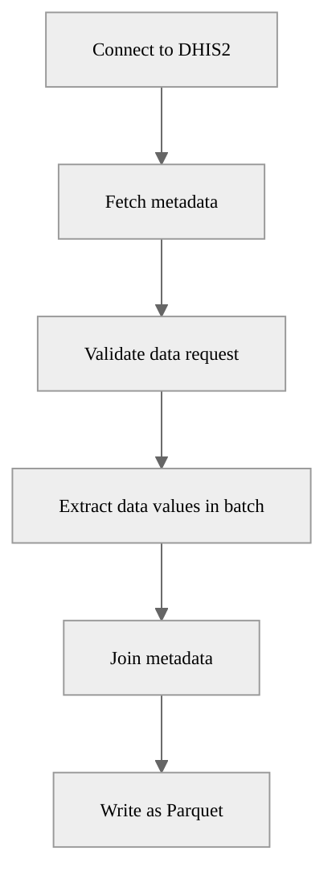

# DHIS2 Data Elements Extraction Pipeline

## Description

This pipeline extracts data values for specified data elements from a DHIS2 instance, processes the data, and saves it as a Parquet file.

## Example usage


## Parameters

| Parameter | Type | Required | Default | Description |
|-----------|------|----------|---------|-------------|
| Source DHIS2 | DHIS2 Connection | Yes | - | Source DHIS2 instance to extract data from |
| Data elements | List of String | Yes | - | Data elements to extract |
| Organisation units | List of String | No | - | IDs of organisation units to extract data from |
| Organisation unit groups | List of String | No | - | IDs of organisation unit groups to extract data from |
| Include children | Boolean | No | `False` | Whether to include children of the selected organisation units |
| Start date | String | Yes | `2020-01-01` | Start date for the extraction (YYYY-MM-DD) |
| End date | String | No | - | End date for the extraction (today by default) |
| Output file | String | No | - | Custom output file path in workspace (default: auto-generated) |

⚠️

A valid DHIS2 data extraction request is composed of *one unit of information for each dimension*:

* Data dimension (what?): Data elements
* Spatial dimension (where?): Organisation units **or** Organisation unit groups
* Temporal dimension (when?): Start date, End date

Multiple parameters per dimension are not allowed. For example, you cannot specify both organisation units and organisation unit groups, or both start date and end date.

## Output

The pipeline generates a Parquet file containing the extracted data values with enriched metadata. By default, the file is saved to:

```
<workspace>/pipelines/dhis2_extract_data_elements/<timestamp>/data_values.parquet
```

The output includes:
- DHIS2 data values for the specified data elements
- Periods
- Data element names
- Organisation unit names and hierarchy information
- Category option combo names

```
┌─────────────────┬───────────────────┬──────────────────────┬──────────────────────────┬────────────────────────────┬───────────────────────────┬────────┬───────┬─────────────┬─────────────┬─────────────┬─────────────┬──────────────┬──────────────┬──────────────┬──────────────┬─────────────────────────┬─────────────────────────┐
│ data_element_id ┆ data_element_name ┆ organisation_unit_id ┆ category_option_combo_id ┆ category_option_combo_name ┆ attribute_option_combo_id ┆ period ┆ value ┆ level_1_id  ┆ level_2_id  ┆ level_3_id  ┆ level_4_id  ┆ level_1_name ┆ level_2_name ┆ level_3_name ┆ level_4_name ┆ created                 ┆ last_updated            │
│ ---             ┆ ---               ┆ ---                  ┆ ---                      ┆ ---                        ┆ ---                       ┆ ---    ┆ ---   ┆ ---         ┆ ---         ┆ ---         ┆ ---         ┆ ---          ┆ ---          ┆ ---          ┆ ---          ┆ ---                     ┆ ---                     │
│ str             ┆ str               ┆ str                  ┆ str                      ┆ str                        ┆ str                       ┆ str    ┆ str   ┆ str         ┆ str         ┆ str         ┆ str         ┆ str          ┆ str          ┆ str          ┆ str          ┆ datetime[ms, UTC]       ┆ datetime[ms, UTC]       │
╞═════════════════╪═══════════════════╪══════════════════════╪══════════════════════════╪════════════════════════════╪═══════════════════════════╪════════╪═══════╪═════════════╪═════════════╪═════════════╪═════════════╪══════════════╪══════════════╪══════════════╪══════════════╪═════════════════════════╪═════════════════════════╡
│ pikOziyCXbM     ┆ OPV1 doses given  ┆ vELbGdEphPd          ┆ Prlt0C1RF0s              ┆ Fixed, <1y                 ┆ HllvX50cXC0               ┆ 202001 ┆ 25    ┆ ImspTQPwCqd ┆ O6uvpzGd5pu ┆ zFDYIgyGmXG ┆ vELbGdEphPd ┆ Sierra Leone ┆ Bo           ┆ Bargbo       ┆ Jimmi CHC    ┆ 2022-09-05 13:06:21 UTC ┆ 2010-02-27 00:00:00 UTC │
│ pikOziyCXbM     ┆ OPV1 doses given  ┆ vELbGdEphPd          ┆ V6L425pT3A0              ┆ Outreach, <1y              ┆ HllvX50cXC0               ┆ 202002 ┆ 13    ┆ ImspTQPwCqd ┆ O6uvpzGd5pu ┆ zFDYIgyGmXG ┆ vELbGdEphPd ┆ Sierra Leone ┆ Bo           ┆ Bargbo       ┆ Jimmi CHC    ┆ 2022-09-05 13:06:21 UTC ┆ 2010-05-10 00:00:00 UTC │
│ pikOziyCXbM     ┆ OPV1 doses given  ┆ vELbGdEphPd          ┆ Prlt0C1RF0s              ┆ Fixed, <1y                 ┆ HllvX50cXC0               ┆ 202002 ┆ 26    ┆ ImspTQPwCqd ┆ O6uvpzGd5pu ┆ zFDYIgyGmXG ┆ vELbGdEphPd ┆ Sierra Leone ┆ Bo           ┆ Bargbo       ┆ Jimmi CHC    ┆ 2022-09-05 13:06:21 UTC ┆ 2010-05-10 00:00:00 UTC │
│ pikOziyCXbM     ┆ OPV1 doses given  ┆ vELbGdEphPd          ┆ Prlt0C1RF0s              ┆ Fixed, <1y                 ┆ HllvX50cXC0               ┆ 202004 ┆ 38    ┆ ImspTQPwCqd ┆ O6uvpzGd5pu ┆ zFDYIgyGmXG ┆ vELbGdEphPd ┆ Sierra Leone ┆ Bo           ┆ Bargbo       ┆ Jimmi CHC    ┆ 2022-09-05 13:06:21 UTC ┆ 2010-05-27 00:00:00 UTC │
│ pikOziyCXbM     ┆ OPV1 doses given  ┆ vELbGdEphPd          ┆ Prlt0C1RF0s              ┆ Fixed, <1y                 ┆ HllvX50cXC0               ┆ 202003 ┆ 44    ┆ ImspTQPwCqd ┆ O6uvpzGd5pu ┆ zFDYIgyGmXG ┆ vELbGdEphPd ┆ Sierra Leone ┆ Bo           ┆ Bargbo       ┆ Jimmi CHC    ┆ 2022-09-05 13:06:21 UTC ┆ 2010-05-28 00:00:00 UTC │
│ …               ┆ …                 ┆ …                    ┆ …                        ┆ …                          ┆ …                         ┆ …      ┆ …     ┆ …           ┆ …           ┆ …           ┆ …           ┆ …            ┆ …            ┆ …            ┆ …            ┆ …                       ┆ …                       │
│ pikOziyCXbM     ┆ OPV1 doses given  ┆ vELbGdEphPd          ┆ Prlt0C1RF0s              ┆ Fixed, <1y                 ┆ HllvX50cXC0               ┆ 202503 ┆ 30    ┆ ImspTQPwCqd ┆ O6uvpzGd5pu ┆ zFDYIgyGmXG ┆ vELbGdEphPd ┆ Sierra Leone ┆ Bo           ┆ Bargbo       ┆ Jimmi CHC    ┆ 2022-09-05 12:45:50 UTC ┆ 2010-05-27 00:00:00 UTC │
│ x3Do5e7g4Qo     ┆ OPV0 doses given  ┆ vELbGdEphPd          ┆ Prlt0C1RF0s              ┆ Fixed, <1y                 ┆ HllvX50cXC0               ┆ 202501 ┆ 20    ┆ ImspTQPwCqd ┆ O6uvpzGd5pu ┆ zFDYIgyGmXG ┆ vELbGdEphPd ┆ Sierra Leone ┆ Bo           ┆ Bargbo       ┆ Jimmi CHC    ┆ 2022-09-05 12:45:50 UTC ┆ 2010-02-27 00:00:00 UTC │
│ x3Do5e7g4Qo     ┆ OPV0 doses given  ┆ vELbGdEphPd          ┆ Prlt0C1RF0s              ┆ Fixed, <1y                 ┆ HllvX50cXC0               ┆ 202502 ┆ 31    ┆ ImspTQPwCqd ┆ O6uvpzGd5pu ┆ zFDYIgyGmXG ┆ vELbGdEphPd ┆ Sierra Leone ┆ Bo           ┆ Bargbo       ┆ Jimmi CHC    ┆ 2022-09-05 12:45:50 UTC ┆ 2010-05-10 00:00:00 UTC │
│ x3Do5e7g4Qo     ┆ OPV0 doses given  ┆ vELbGdEphPd          ┆ Prlt0C1RF0s              ┆ Fixed, <1y                 ┆ HllvX50cXC0               ┆ 202504 ┆ 33    ┆ ImspTQPwCqd ┆ O6uvpzGd5pu ┆ zFDYIgyGmXG ┆ vELbGdEphPd ┆ Sierra Leone ┆ Bo           ┆ Bargbo       ┆ Jimmi CHC    ┆ 2022-09-05 12:45:50 UTC ┆ 2010-05-28 00:00:00 UTC │
│ x3Do5e7g4Qo     ┆ OPV0 doses given  ┆ vELbGdEphPd          ┆ Prlt0C1RF0s              ┆ Fixed, <1y                 ┆ HllvX50cXC0               ┆ 202503 ┆ 23    ┆ ImspTQPwCqd ┆ O6uvpzGd5pu ┆ zFDYIgyGmXG ┆ vELbGdEphPd ┆ Sierra Leone ┆ Bo           ┆ Bargbo       ┆ Jimmi CHC    ┆ 2022-09-05 12:45:50 UTC ┆ 2010-05-27 00:00:00 UTC │
└─────────────────┴───────────────────┴──────────────────────┴──────────────────────────┴────────────────────────────┴───────────────────────────┴────────┴───────┴─────────────┴─────────────┴─────────────┴─────────────┴──────────────┴──────────────┴──────────────┴──────────────┴─────────────────────────┴─────────────────────────┘
```

## Pipeline Flow


