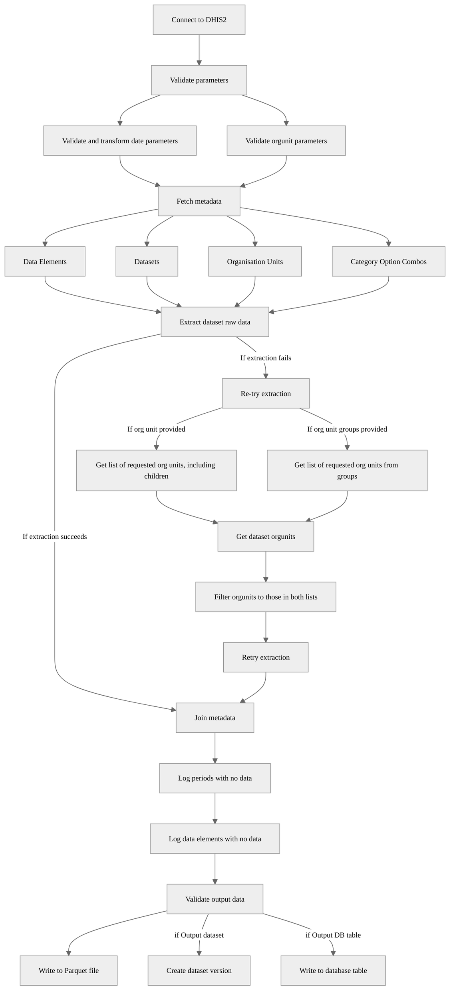

# DHIS2 Dataset Extraction Pipeline

This pipeline extracts datasets from DHIS2 instance. The extracted data is validated, enriched with metadata, and saved into a parquet file and a CSV file;  and optionally into a database table and an OpenHexa dataset.

## 📑 Example Use

Parameters: 


Outputs, including logs specifying warnings for missing data elements and periods:


## 🛠️ Parameters

| Parameter            | Type            |Required|Default| Description |
|----------------------|-----------------|--------|-------|-------------|
| DHIS2 Connection     | DHIS2Connection | Yes    | -     | Connection to DHIS2 instance |
| INPUT: DHIS2 dataset | str             | Yes    | -     | DHIS2 dataset ID to extract |
| Start Date (ISO format) | str  | Yes    | -     | Start date for extraction |
| End Date (ISO format) | str  | No    | Today  | End date for extraction |
| Output dataset | Dataset | No | - | OpenHEXA dataset. A new version will be created if new content is detected |
| Output DB table | String | No | - | Database table name for storing the extracted data |
| Name your extraction | String | No | Auto-generated | Custom output file path in workspace |
| Orgunits         | list[str]       | No | - | Specific OrgUnit IDs |
| Include children (of orgunits)  | bool            | No | Yes | Include children of selected OrgUnits |
| Group(s) of orgunits     | list[str]        | No | - | OrgUnit Group IDs |
| Optional: Maximum number of orgunits per request | int | No | 200 | Max number of orgunits per request to DHIS2 API |

A valid DHIS2 analytics request is composed of *one unit of information for each dimension*:

* Spatial dimension (where?): Organisation units, Organisation unit groups, **or** Organisation unit levels.
* Temporal dimension (when?): Start period, End period. Multiple DHIS2 period types (weekly, monthly, yearly, etc.) are accepted.

Multiple parameters per dimension are not allowed. For example, you cannot specify both organisation unit groups and organisation unit levels.

## Output

The pipeline supports three output options that can be used individually or in combination:

### 1. File Output (Parquet, csv)
The pipeline generates a Parquet and a csv file containing the extracted data with enriched metadata. 

- If the parameter `Name your extraction` is not provided, the files are saved to:
```
<workspace>/pipelines/dhis2_extract_dataset/<dhis2_name>/<dataset_name>/<timestamp>
```

- If the parameter `Name your extraction` is provided, the files are saved to:
```
<workspace>/pipelines/dhis2_extract_dataset/<dhis2_name>/<dataset_name>/<timestamp-extract-name>
```

### 2. OpenHEXA Dataset
When an `Output dataset` is specified, the pipeline will:
- Create a new version (v1, v2, v3, etc.)
- Save the files in the new version

### 3. Database Table
When an `Output DB table` name is provided, the extracted data will be written directly to the workspace database, replacing any existing table with the same name.

### Output Data Structure
The output has a line per each of the values extracted from the dataset. For each of these values, we can find:
- The data Element ID + name.
- The period + the period type.
- The organizational unit ID + name, along with the hierarchy levels it belongs to. 
- The category option combo ID and the attribute option combo ID (if applicable). 
- The dataset name.
- Metadata information for the value (when was it created, update, etc. )

### Example Output Data (Tabular Format)

| dx           | pe         | ou           | categoryOptionCombo | attributeOptionCombo | value | storedBy | created                      | lastUpdated                   | comment | followup | dataset      | periodType | dx_name        | co_name | id           | name               | level_4_id    | level_4_name      | level_1_id   | level_2_id   | level_3_id   | level_1_name   | level_2_name | level_3_name   |
|--------------|------------|--------------|--------------------|---------------------|-------|----------|------------------------------|-------------------------------|---------|----------|--------------|------------|----------------|---------|--------------|--------------------|--------------|-------------------|--------------|--------------|--------------|---------------|--------------|---------------|
| UsSUX0cpKsH  | 2024-01-01 | nX05QLraDhO  | HllvX50cXC0        | HllvX50cXC0         | 0     |          | 2017-05-24T13:59:34.000+0000 | 2017-05-24T13:59:31.000+0000  |         | FALSE    | IDSR Weekly  | Weekly     | IDSR Cholera   | default | nX05QLraDhO  | Yamandu CHC        | nX05QLraDhO  | Yamandu CHC       | ImspTQPwCqd  | O6uvpzGd5pu  | vWbkYPRmKyS  | Sierra Leone  | Bo           | Baoma         |
| UsSUX0cpKsH  | 2024-01-01 | EFTcruJcNmZ  | HllvX50cXC0        | HllvX50cXC0         | 4     |          | 2017-05-24T13:59:34.000+0000 | 2017-05-24T13:59:31.000+0000  |         | FALSE    | IDSR Weekly  | Weekly     | IDSR Cholera   | default | EFTcruJcNmZ  | Yengema CHP        | EFTcruJcNmZ  | Yengema CHP       | ImspTQPwCqd  | O6uvpzGd5pu  | BGGmAwx33dj  | Sierra Leone  | Bo           | Bumpe Ngao    |
| UsSUX0cpKsH  | 2024-01-01 | CTOMXJg41hz  | HllvX50cXC0        | HllvX50cXC0         | 1     |          | 2017-05-24T13:59:34.000+0000 | 2017-05-24T13:59:31.000+0000  |         | FALSE    | IDSR Weekly  | Weekly     | IDSR Cholera   | default | CTOMXJg41hz  | Kaniya MCHP        | CTOMXJg41hz  | Kaniya MCHP       | ImspTQPwCqd  | O6uvpzGd5pu  | BGGmAwx33dj  | Sierra Leone  | Bo           | Bumpe Ngao    |
| UsSUX0cpKsH  | 2024-01-01 | E497Rk80ivZ  | HllvX50cXC0        | HllvX50cXC0         | 0     |          | 2017-05-24T13:59:34.000+0000 | 2017-05-24T13:59:31.000+0000  |         | FALSE    | IDSR Weekly  | Weekly     | IDSR Cholera   | default | E497Rk80ivZ  | Bumpe CHC          | E497Rk80ivZ  | Bumpe CHC         | ImspTQPwCqd  | O6uvpzGd5pu  | BGGmAwx33dj  | Sierra Leone  | Bo           | Bumpe Ngao    |
| UsSUX0cpKsH  | 2024-01-01 | mwN7QuEfT8m  | HllvX50cXC0        | HllvX50cXC0         | 0     |          | 2017-05-24T13:59:34.000+0000 | 2017-05-24T13:59:31.000+0000  |         | FALSE    | IDSR Weekly  | Weekly     | IDSR Cholera   | default | mwN7QuEfT8m  | Koribondo CHC      | mwN7QuEfT8m  | Koribondo CHC     | ImspTQPwCqd  | O6uvpzGd5pu  | daJPPxtIrQn  | Sierra Leone  | Bo           | Jaiama Bongor |
| UsSUX0cpKsH  | 2024-01-01 | E9oBVjyEaCe  | HllvX50cXC0        | HllvX50cXC0         | 4     |          | 2017-05-24T13:59:34.000+0000 | 2017-05-24T13:59:31.000+0000  |         | FALSE    | IDSR Weekly  | Weekly     | IDSR Cholera   | default | E9oBVjyEaCe  | Gbanja Town MCHP   | E9oBVjyEaCe  | Gbanja Town MCHP  | ImspTQPwCqd  | O6uvpzGd5pu  | U6Kr7Gtpidn  | Sierra Leone  | Bo           | Kakua         |
| UsSUX0cpKsH  | 2024-01-01 | tGf942oWszb  | HllvX50cXC0        | HllvX50cXC0         | 2     |          | 2017-05-24T13:59:34.000+0000 | 2017-05-24T13:59:31.000+0000  |         | FALSE    | IDSR Weekly  | Weekly     | IDSR Cholera   | default | tGf942oWszb  | Gbongboma MCHP     | tGf942oWszb  | Gbongboma MCHP    | ImspTQPwCqd  | O6uvpzGd5pu  | U6Kr7Gtpidn  | Sierra Leone  | Bo           | Kakua         |

## Validation

The output data is validated; checking that:
- The DataFrame is not empty
- All required columns are present
- Columns have the expected data types
- Certain columns have no null values
If the validation fails, the pipeline raises an error and stops execution.


## Pipeline Flow



