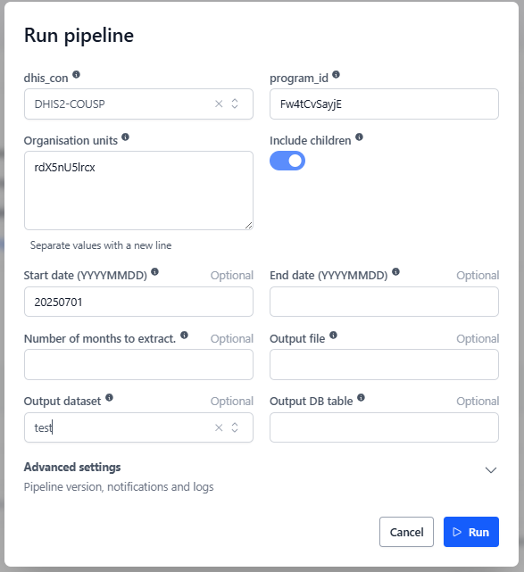
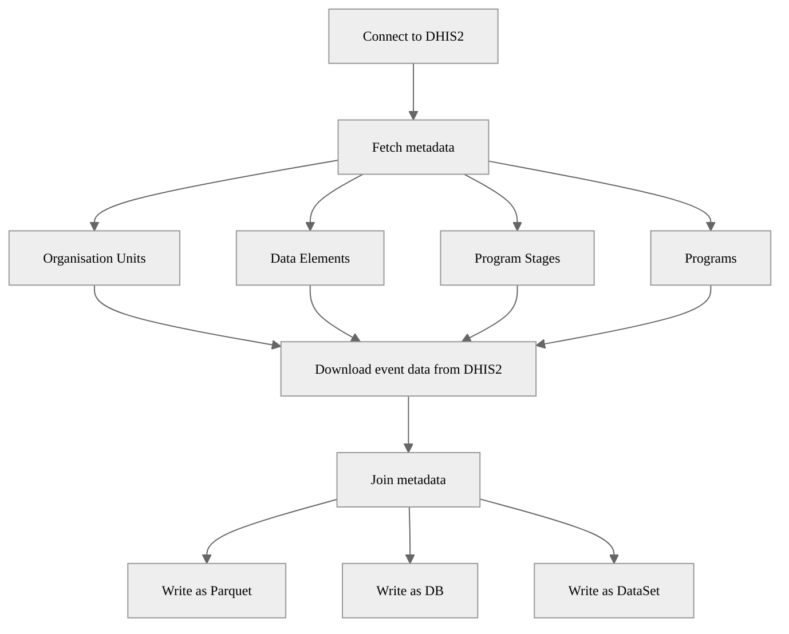

# DHIS2 Events Extraction Pipeline

## Description

This pipeline extracts events for a specified program from a DHIS2 instance, processes the data, and saves it as a Parquet file. It can also save it in a database and in a dataset. 

## Example usage



## Parameters

| Parameter | Type | Required | Default | Description |
|-----------|------|----------|---------|-------------|
| Source DHIS2 | DHIS2 Connection | Yes | - | Source DHIS2 instance to extract data from |
| Program ID |str | Yes | - | The ID of the program we wish to extract events from |
| Organisation units | List of String | Yes | - | IDs of organisation units to extract data from |
| Include children | Boolean | No | `False` | Whether to include children of the selected organisation units |
| Start date | str | No |  | Start date for the extraction (YYYY-MM-DD) |
| End date | str | No | - | End date for the extraction (YYYY-MM-DD) (today by default) |
| Period | int | No | - | Number of months to extract data for |
| Output file | str | No | - | Custom output file path in workspace (default: auto-generated) |
| Output dataset | Dataset | No | - | Output OpenHEXA dataset |
| Output DB table | str | No | - | Output BD table name |

⚠️

For the extraction dates, we will:

* If no end date is provided, we will use today.
* If no start date is provided, we will calculate as end date minus period

Either the start date or the period need to be provided. 

## Output

The pipeline generates a Parquet file containing the extracted events with enriched metadata. By default, the file is saved to:

```
<workspace>/pipelines/dhis2_tracker_extract/<timestamp>/events.parquet
```

The output includes a list of events with: 
- The event id, its status and whether its been deleted or not. 
- When it occurred.
- The program id and name; the program stage and name.
- The enrrollement id and the tracked entity type id.
- The data elements (ids and names) and their corresponding value associated to each event.

| event_id    | status    | deleted   | occurred_at         | program_id   | program_name         | program_stage_id   | program_stage_name      | enrollment_id   | tracked_entity_id   | data_element_id   | data_element_name               | value           | organisation_unit_id   | attribute_option_combo_id   | level_1_id   | level_1_name   | level_2_id   | level_2_name   | level_3_id   | level_3_name   | level_4_id   | level_4_name   | level_5_id   | level_5_name   | level_6_id   | level_6_name   |
|:------------|:----------|:----------|:--------------------|:-------------|:---------------------|:-------------------|:------------------------|:----------------|:--------------------|:------------------|:--------------------------------|:----------------|:-----------------------|:----------------------------|:-------------|:---------------|:-------------|:---------------|:-------------|:---------------|:-------------|:---------------|:-------------|:---------------|:-------------|:---------------|
| nNU0IbUKnbB | COMPLETED | False     | 2025-08-04 00:00:00 | Fw4tCvSayjE  | Surveillance des cas | pyc3PH9jRpL        | Résultat Laboratoire    | BsFvGSZsDwN     | huVJZc02GDU         | abTAdYiASX2       | Type d'equipement utilise       | GeneXpert       | rdX5nU5lrcx            | HllvX50cXC0                 | rdX5nU5lrcx  | Burundi        |              |                |              |                |              |                |              |                |              |                |
| qJ07AOhuhKb | COMPLETED | False     | 2025-07-21 00:00:00 | Fw4tCvSayjE  | Surveillance des cas | xk02Vu8vZ6l        | Notification            | X77lEmLPyyG     | b8VfFJEpsX2         | oSUDpA1ch3U       | Autres comorbidites             | false           | rdX5nU5lrcx            | HllvX50cXC0                 | rdX5nU5lrcx  | Burundi        |              |                |              |                |              |                |              |                |              |                |
| ILpVvyrJ7qE | COMPLETED | False     | 2025-07-22 00:00:00 | Fw4tCvSayjE  | Surveillance des cas | EDLKq7Q4L2G        | Prise en charge Choléra | X77lEmLPyyG     | b8VfFJEpsX2         | SvQsxsKaBls       | Decision medicale               | HOSP            | rdX5nU5lrcx            | HllvX50cXC0                 | rdX5nU5lrcx  | Burundi        |              |                |              |                |              |                |              |                |              |                |
| m7t0oL3pl3G | COMPLETED | False     | 2025-08-01 00:00:00 | Fw4tCvSayjE  | Surveillance des cas | pyc3PH9jRpL        | Résultat Laboratoire    | eQe1kXL1TO6     | Xitpxgt3zyw         | VWn2r8dAWbq       | Nom du responsable de l'analyse | MANISHAKA Aimee | rdX5nU5lrcx            | HllvX50cXC0                 | rdX5nU5lrcx  | Burundi        |              |                |              |                |              |                |              |                |              |                |
| rQDKDNF9ysg | COMPLETED | False     | 2025-08-06 00:00:00 | Fw4tCvSayjE  | Surveillance des cas | xk02Vu8vZ6l        | Notification            | mjrcwmJK0qz     | tfxSV3Bw0Ms         | d1L9O3pWfu1       | Maux de gorge                   | true            | rdX5nU5lrcx            | HllvX50cXC0                 | rdX5nU5lrcx  | Burundi        |              |                |              |                |              |                |              |                |              |                |

Optionally, and if the names are provided, the code will:
* Save the .parquet file in a OpenHEXA dataset.
* Save the dataframe as a database table.

## Pipeline Flow


