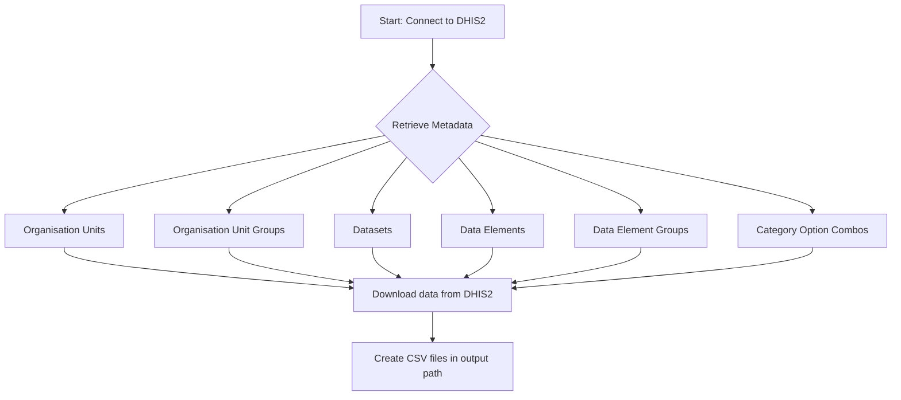

# DHIS2 Metadata Extract

The pipeline downloads the selected metadata from a DHIS2 instance, and saves an output as CSV file.

## Parameters

**DHIS2 connection**  
DHIS2 connection selection to extract the data from.

**Organisation Units**  
Whether to retrieve Organisation units.

**Organisation Unit Groups**  
Whether to retrieve Organisation unit groups.

**Datasets**  
Whether to retrieve Dataset metadata.
 
**Data Elements**  
Whether to retrieve Data Elements metadata (list of data elements).

**Data Element Groups**  
Whether to retrieve Data Element groups metadata (list of data elements).

**Category option combos**  
Whether to retrieve Category Option Combos.

**Output directory**  
This is the directory in the OpenHEXA workspace where the data will be saved.
If the user does not specify this parameter, the pipeline will create a new folder named using the following format:
**data_yyyy_mm_dd_hhmm** 

Each output file will be saved with a filename following this pattern:
**(metadata name)_yyyy_mm_dd_hhmm**

## Data format

The pipeline downloads raw metadata depending on the user selection from the source DHIS2 and creates the corresponding files in the indicated output path in OpenHEXA workspace. 
All outputs are stored in format **.csv**.

**Example of Data element groups:**

## Example run

## Flow

