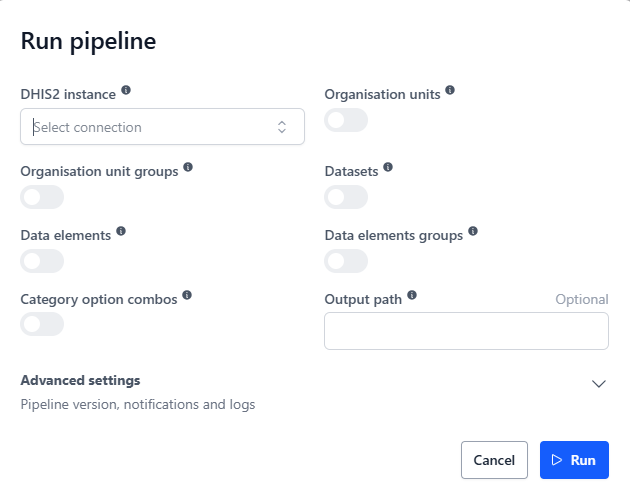
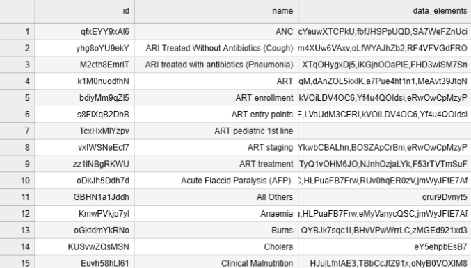
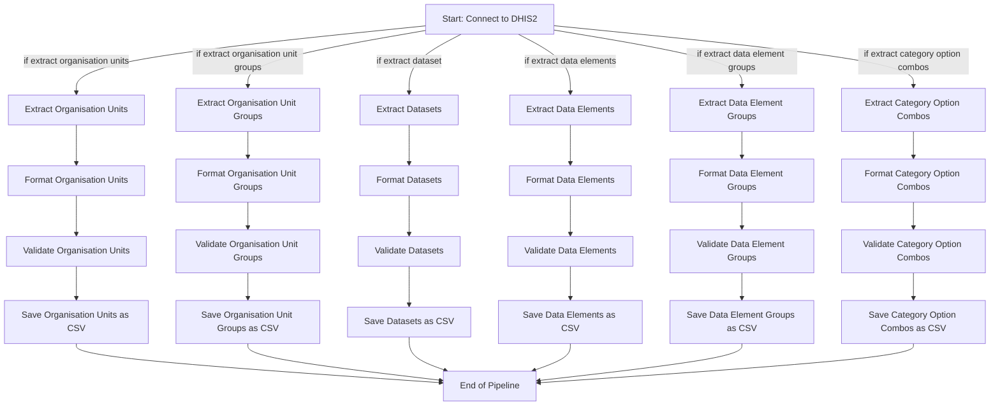

# DHIS2 Metadata Extract

This pipeline extracts metadata from a DHIS2 instance, saving it as a CSV file for further analysis. It is able to extract metadata for: Organisation Units, Organisation Unit Groups, Datasets, Data Elements, Data Element Groups, and Category Option Combos.

## Example run



## Parameters

| Parameter | Type | Required | Default | Description |
|-----------|------|----------|---------|-------------|
| Source DHIS2 instance | DHIS2 Connection | Yes | - | The DHIS2 instance to extract data from |
| Organisation Units | Bool | Yes | False | Whether to extract Organisation Units metadata |
| Organisation Unit Groups | Bool | Yes | False | Whether to extract Organisation Unit Groups metadata |
| Datasets | Bool | Yes | False | Whether to extract Dataset metadata |
| Data Elements | Bool | Yes | False | Whether to extract Data Elements metadata |
| Data Element Groups | Bool | Yes | False | Whether to extract Data Element Groups metadata |
| Category Option Combos | Bool | Yes | False | Whether to extract Category Option Combos metadata |
| Output path | String | No | Auto-generated | Custom output file path in workspace |

## Output

### 1. File Output (csv)
The pipeline generates csv files containing the extracted metadata. 

- If the parameter `Output file` is not provided, the files are saved to:
```
<workspace>/pipelines/dhis2_metadata_extract/<timestamp>
```

- If the parameter `Output file` is provided, the files are saved to the specified path. 

Each of the output files will be saved with a filename following this pattern:
**(metadata name)_yyyy_mm_dd_hhmm.csv**

### Output Data Structure

The pipeline extracts metadata from the DHIS2 instance and saves it in CSV format. The metadata that is extracted depends on the user's selection of parameters.

**Example of Data element groups:**



## Formatting and validation
After the metadata is extracted from the DHIS2 instance, it is formatted and validated to ensure consistency and accuracy.

The formatting includes dropping unnecessary columns and transforming the data-types into more usable formats.

The validation includes: 
- The DataFrame is not empty
- All required columns are present
- Columns have the expected data types
- Certain columns have no null values
If the validation fails, the pipeline raises an error and stops execution.


## Flow

