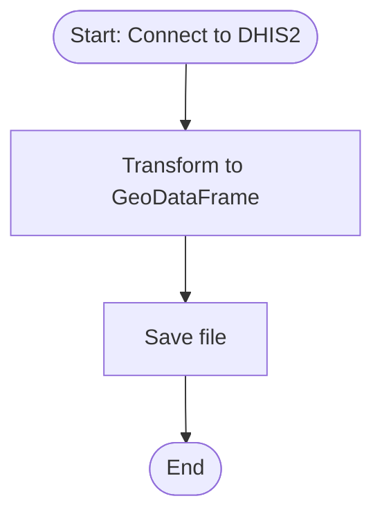

# DHIS2 Shapes Extract

The pipeline downloads geometry data from DHIS2 instances and write a geopandas file 
to a directory in the OpenHEXA workspace.

## Parameters

**Source DHIS2 connection**  
DHIS2 connection selection to extract the data from.
fields being sync : "id,name,shortName,openingDate,closedDate,parent,level,path,geometry"

**Organisation unit level**
Organisation unit level selection from which geometries will be retrieved.

**Output directory**
Directory in OpenHEXA workspace where raw data will be saved.

## Data format

The pipeline downloads raw organization units metadata from the target DHIS2 and stores a formated table in the indicated output path in OpenHEXA
workspace. 
The output file is stored as a geodataframe format **.gpkg** and attached to the pipeline run at the end of the execution.

## Example run

## Flow

