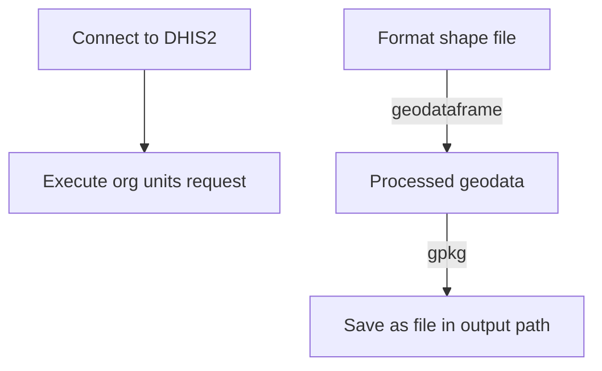

# DHIS2 Shapes Extract

The pipeline downloads geometry data from DHIS2 instances and write a geopandas dataframe 
extracts to a directory in the OpenHEXA workspace.

## Parameters

**DHIS2 connection**  
Depth of the pyramid from where we extract the shapes.

**Pyramid level**  
Depth of the pyramid from where we extract the shapes.

**Output directory**  
Directory in OpenHEXA workspace where raw data will be saved.
DHIS2_shapes_extract/

## Data format

The pipeline downloads raw organization units metadata from the target DHIS2 and stores a formated table in the indicated output path in OpenHEXA
workspace. The output file is stored as a geodataframe format (.gpkg).

## Example run

## Flow

