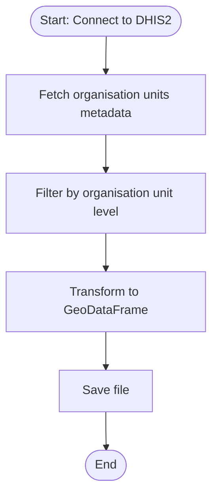

# DHIS2 Shapes Extract

This pipeline extracts the geometry data from DHIS2 instances and writes it as a geopandas file.

## Example run


## Parameters

| Parameter | Type | Required | Default | Description |
|-----------|------|----------|---------|-------------|
| DHIS2 connection | DHIS2 Connection | Yes | - | The DHIS2 instance to extract data from |
| Organisation unit level | String | No | 2 | Organisation unit level to extract geometries from |
| Output directory | String | No | Auto-generated | Custom output file path in workspace |

## Output

### 1. File Output (gpkg)
The pipeline generates a gpkg file containing the extracted organization units metadata. 

- If the parameter `Output directory` is not provided, the file is saved to:
```
<workspace>/pipelines/dhis2_shapes_extract/shapes_level<org_level>_<timestamp>.gpkg
```

- If the parameter `Output directory` is provided, the file is saved to the specified path as shapes_level<org_level>_<timestamp>.gpkg.

### Output Data Structure


## Flow

