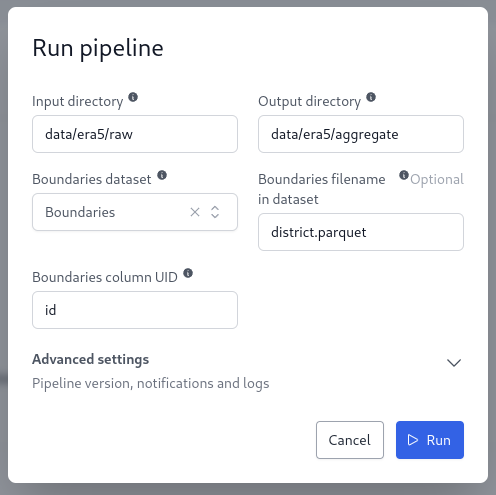
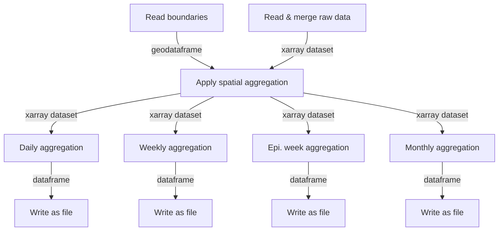

# ERA5 Aggregate Pipeline

This repository contains the OpenHEXA ETL pipeline to aggregate climate data from the ERA5-Land dataset in the [Climate Data Store](https://cds.climate.copernicus.eu/datasets/reanalysis-era5-land?tab=overview). The pipeline relies on the `openhexa.toolbox.era5` package.

## ERA5 Aggregate Pipeline

The `era5_aggregate` pipeline aggregates raw hourly data in space and time according to an input geographic file.

### Parameters

- **Input directory**: Input directory with raw ERA5 extracts in GRIB2 format (`*.grib`).
- **Output directory**: Output directory for the aggregated data.
- **Boundaries dataset**: Input dataset containing boundaries geometries (`*.parquet`, `*.geojson` or `*.gpkg`).
- **Boundaries filename**: Filename of the boundaries file to use in the boundaries dataset.
- **Boundaries column UID**: Column name containing unique identifier for boundaries geometries.

### Example Usage



### Input files

The pipeline expects GRIB2 files organized by variable. For example:

```
data/
└── era5/
    └── raw/
        ├── 2m_temperature/
        │   ├── 202401_b871ac4b-4b91-4b8a-a18a-c9689ee0704e.grib
        │   └── 202402_80741a96-a609-4917-bd35-f1c3163b4e70.grib
        ├── total_precipitation/
        │   ├── 202401_197e4c87-5174-49e0-9f2e-6c99c61d3f08.grib
        │   └── 202402_302bd57d-4421-4160-b646-af4acdc9a431.grib
        └── volumetric_soil_water_layer_1/
            ├── 202401_302bd57d-4421-4160-b646-af4acdc9a431.grib
            └── 202402_4c5fefc287ca187d465ea7452e351fa3.grib
```

Input files for a given variables are automatically merged on read to consolidate the source dataset.

### Output files

The pipeline generates daily, weekly, and monthly aggregated data files. For example:

```
data/
└── era5/
    └── aggregate/
        ├── 2m_temperature/
        │   ├── 2m_temperature_daily.parquet
        │   ├── 2m_temperature_weekly.parquet
        │   ├── 2m_temperature_epi_weekly.parquet
        │   └── 2m_temperature_monthly.parquet
        ├── total_precipitation/
        │   ├── total_precipitation_daily.parquet
        │   ├── total_precipitation_weekly.parquet
        │   ├── total_precipitation_epi_weekly.parquet
        │   └── total_precipitation_monthly.parquet
        └── volumetric_soil_water_layer_1/
            ├── volumetric_soil_water_layer_1_daily.parquet
            ├── volumetric_soil_water_layer_1_weekly.parquet
            ├── volumetric_soil_water_layer_1_epi_weekly.parquet
            └── volumetric_soil_water_layer_1_monthly.parquet
```

Example of monthly output:

```
shape: (4_320, 5)
┌─────────────┬────────┬───────────┬───────────┬───────────┐
│ boundary_id ┆ month  ┆ mean      ┆ min       ┆ max       │
│ ---         ┆ ---    ┆ ---       ┆ ---       ┆ ---       │
│ str         ┆ str    ┆ f64       ┆ f64       ┆ f64       │
╞═════════════╪════════╪═══════════╪═══════════╪═══════════╡
│ AXYBpkHRL1P ┆ 202001 ┆ 23.498571 ┆ 11.620264 ┆ 33.31405  │
│ Ba9fjaGqMvm ┆ 202001 ┆ 19.51974  ┆ 7.395044  ┆ 32.177179 │
│ BhQvFsoq1p0 ┆ 202001 ┆ 23.537051 ┆ 11.164056 ┆ 33.51571  │
│ C1eBUx1jJvA ┆ 202001 ┆ 25.068807 ┆ 12.7521   ┆ 34.677057 │
│ CwgbNoqVy6u ┆ 202001 ┆ 19.169628 ┆ 8.004022  ┆ 31.908563 │
│ …           ┆ …      ┆ …         ┆ …         ┆ …         │
│ vbOyP480RvU ┆ 202412 ┆ 20.955567 ┆ 10.73623  ┆ 32.293817 │
│ xF1Tttg1ATQ ┆ 202412 ┆ 21.146269 ┆ 10.673456 ┆ 32.471735 │
│ xLmpawE9Elt ┆ 202412 ┆ 20.991425 ┆ 12.252191 ┆ 31.614648 │
│ xUZYQiaEmtw ┆ 202412 ┆ 24.044641 ┆ 13.411279 ┆ 34.782861 │
│ yxXv7seiH5C ┆ 202412 ┆ 24.262175 ┆ 14.580042 ┆ 34.600214 │
└─────────────┴────────┴───────────┴───────────┴───────────┘
```

Example of weekly output:

```
shape: (18_648, 5)
┌─────────────┬─────────┬───────────┬───────────┬───────────┐
│ boundary_id ┆ week    ┆ mean      ┆ min       ┆ max       │
│ ---         ┆ ---     ┆ ---       ┆ ---       ┆ ---       │
│ str         ┆ str     ┆ f64       ┆ f64       ┆ f64       │
╞═════════════╪═════════╪═══════════╪═══════════╪═══════════╡
│ AXYBpkHRL1P ┆ 2020W1  ┆ 18.901617 ┆ 11.620264 ┆ 26.763177 │
│ Ba9fjaGqMvm ┆ 2020W1  ┆ 14.767267 ┆ 7.395044  ┆ 22.473627 │
│ BhQvFsoq1p0 ┆ 2020W1  ┆ 18.688513 ┆ 11.164056 ┆ 26.432825 │
│ C1eBUx1jJvA ┆ 2020W1  ┆ 20.442035 ┆ 12.7521   ┆ 27.844781 │
│ CwgbNoqVy6u ┆ 2020W1  ┆ 14.759393 ┆ 8.004022  ┆ 21.867212 │
│ …           ┆ …       ┆ …         ┆ …         ┆ …         │
│ vbOyP480RvU ┆ 2024W50 ┆ 22.993042 ┆ 13.187982 ┆ 32.293817 │
│ xF1Tttg1ATQ ┆ 2024W50 ┆ 23.201025 ┆ 13.079279 ┆ 32.471735 │
│ xLmpawE9Elt ┆ 2024W50 ┆ 22.815692 ┆ 14.293604 ┆ 31.614648 │
│ xUZYQiaEmtw ┆ 2024W50 ┆ 25.660156 ┆ 13.411279 ┆ 34.782861 │
│ yxXv7seiH5C ┆ 2024W50 ┆ 25.839203 ┆ 14.580042 ┆ 34.600214 │
└─────────────┴─────────┴───────────┴───────────┴───────────┘
```

### Data Aggregation

The pipeline reads the boundaries dataset, merges raw data files, and performs spatial aggregation to generate daily, weekly, and monthly aggregated data.


