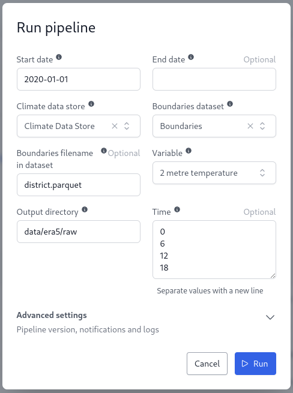
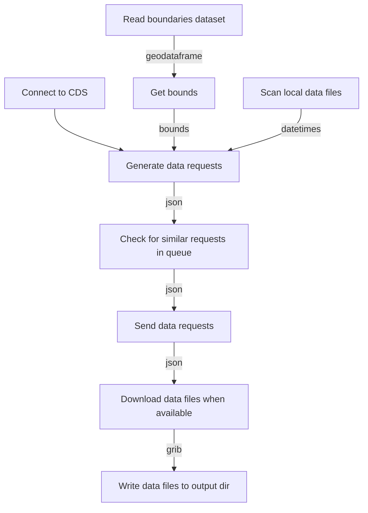

# ERA5 Extract

The pipeline downloads ERA5-Land hourly data from the CDS and write the raw extracts to a directory
in the OpenHEXA workspace.

## Parameters

**Start date**  
Start date of extraction period ("YYYY-MM-DD").

**End date**  
End date of extraction period ("YYYY-MM-DD"). Latest available by default.

**Climate data store**  
OpenHEXA connection to the Copernicus Climate Data Store. Connection is expected to have a `key` field.

**Boundaries dataset**  
OpenHEXA dataset with geographic boundaries. The pipeline will look for a `"*district*.parquet` geoparquet file by default.

**Download 2m temperature data**  
Enable download for 2m temperature variable.

**Download precipitation**  
Enable download for total precipitation variable.

**Download volumetric soil water layer 1 data**  
Enable download for volumetric soil water layer 1 variable.

**Output directory**  
Directory in OpenHEXA workspace where raw data will be saved.

## Supported variables

3 ERA5 variables are supported by the pipeline:

* `2m_temperature`
* `total_precipitation`
* `volumetric_soil_water_layer_1`

New variables can be supported by appending its identifier
to the `variables` list in `era5_extract()`. See documentation of `openhexa.toolbox.era5` for more
info on available variables.

## Data acquisition

Data files can either contain monthly or daily data depending on how they have been downloaded.
They are named accordingly in the output directory. This allows the pipeline to download data as
soon as it is available, wether data is available for the entire month or not.

When executed, the pipeline will check local data availability for each day between the start and
end date. Download requests are only sent if no data is available for the day. If data is need for
all days in a given month, the request will be grouped into a monthly request instead to save on
queue waiting times.

The CDS uses a queue system to handle data requests, which means each download will follow the following steps:

1. Download request is sent to the CDS
2. Download request is added to the queue
3. Download starts (between 5mn and 4h later)

Download speed might be increased if requests were sent for all the required files in advance -
however this might put too much load on the CDS.

## Data format

The pipeline downloads raw hourly data from the CDS and store them as files in the OpenHEXA
workspace. Files are stored in their original format which is `GRIB2`.

## Area of interest

Download requests to the CDS will use the bounding box of the provided geographic file as area of
interest. This is essential to not overload the CDS with daily/weekly requests for world-scale
hourly data.

## CDS connection

The data acquisition pipeline requires an OpenHEXA connection to the CDS setup. The only required
attribute for the connection is the `key`, which can be generated from the user settings panel in
the CDS app. When setting a new connection, the user will have to manually accept the data licenses
of the source dataset (ERA5-Land hourly) in the CDS.

## Example run

## Flow

