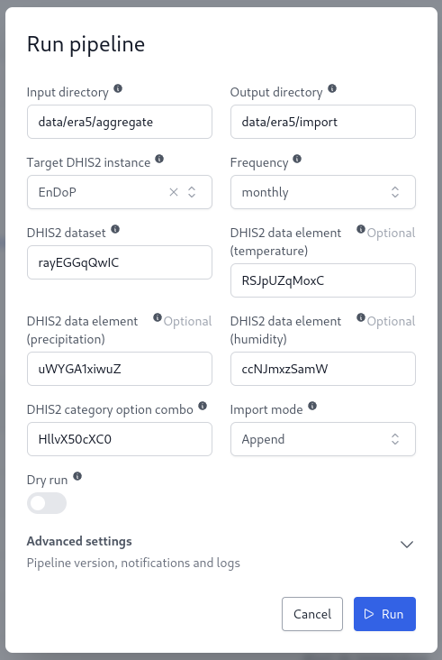
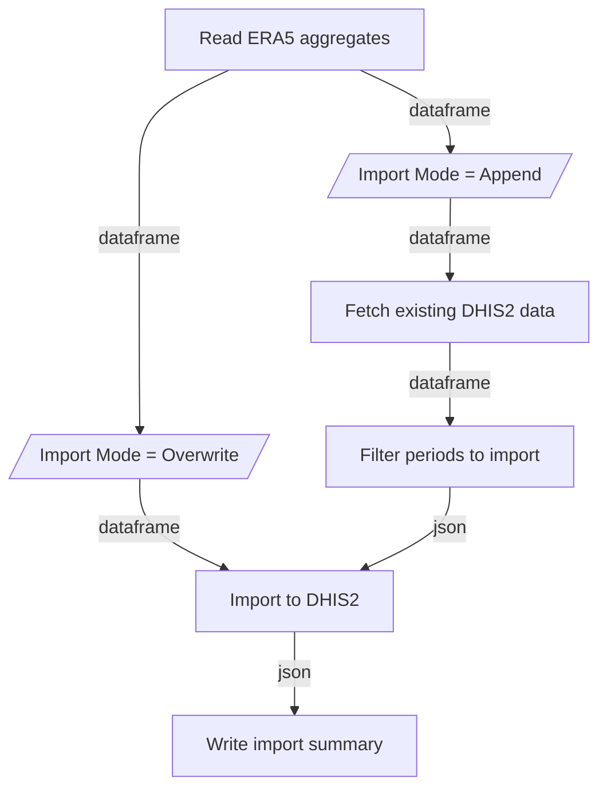

# ERA5 Import DHIS2 Pipeline

The OpenHEXA ETL pipeline imports ERA5 aggregated climate statistics into DHIS2 datasets.

The pipeline depends on the [ERA5 Extract](../era5_extract) and [ERA5 Aggregate](../era5_aggregate) to generate its input files.

## Parameters

* **input_dir** (str) [Optional]
  - Default: `data/era5/aggregate`
  - Directory that contains ERA5 aggregate statistics as `*.parquet` files. The pipeline expects the files to be available according to the following format: `<input_dir>/<variable>/<variable>_<frequency>.parquet`

* **output_dir** (str) [Optional]
  - Default: `data/era5/import`
  - Directory where import reports are saved.

* **dhis2_connection** (DHIS2Connection) [Required]
  - Target DHIS2 instance connection

* **frequency** (str) [Required]
  - Options: weekly or monthly
  - Temporal aggregation frequency

* **dhis2_dataset** (str) [Required]
  - Dataset UID in DHIS2. Must already exists

* **dhis2_dx_temperature** (str) [Optional]
  - Temperature data element UID. Must already exists

* **dhis2_dx_precipitation** (str) [Optional]
  - Precipitation data element UID. Must already exists

* **dhis2_dx_humidity** (str) [Optional]
  - Soil humidity data element UID. Must already exists

* **dhis2_coc** (str) [Optional]
  - Default: `HllvX50cXC0`
  - Category option combo UID. Must already exists

* **import_mode** (str) [Optional]
  - Default: Append
  - Options: Append/Overwrite
  - In `Append` mode, the pipeline will only import data for periods that are not already present in DHIS2. In `Overwrite` mode, the pipeline will import all data, overwriting existing data values if they already exists.

* **dry_run** (bool) [Optional]
  - Default: False
  - Simulate import without saving. The pipeline will still generate the JSON payload and DHIS2 report files.

NB: Climate variables for which no data element UID has been provided will be ignored.

Example run in the OpenHEXA UI:



## Input files

The pipeline expects Parquet files organized by variable and frequency. For example:

```text
data/era5/aggregate/
├── 2m_temperature/
│   ├── 2m_temperature_weekly.parquet
│   └── 2m_temperature_monthly.parquet
├── total_precipitation/
│   ├── total_precipitation_weekly.parquet
│   └── total_precipitation_monthly.parquet
└── volumetric_soil_water_layer_1/
    ├── volumetric_soil_water_layer_1_weekly.parquet
    └── volumetric_soil_water_layer_1_monthly.parquet
```

An error will be raised if the input file cannot be found for a given variable and frequency.

## Flow



## Output files

Two output files are generated:

* `payload.json`: JSON payload imported to DHIS2
* `report.json`: DHIS2 import summary (counts of data values imported, ignored or deleted)

Output files are written to a subdirectory corresponding to the ERA5 variable and the execution date. For example:

```
import/
├── 2m_temperature/
│   └── 2024-01-01_12-00-00/
│       ├── payload.json
│       └── report.json
├── total_precipitation/
│   └── 2024-01-01_12-00-00/
│       ├── payload.json
│       └── report.json
└── soil_volumetric_water_layer_1/
    └── 2024-01-01_12-00-00/
        ├── payload.json
        └── report.json
```