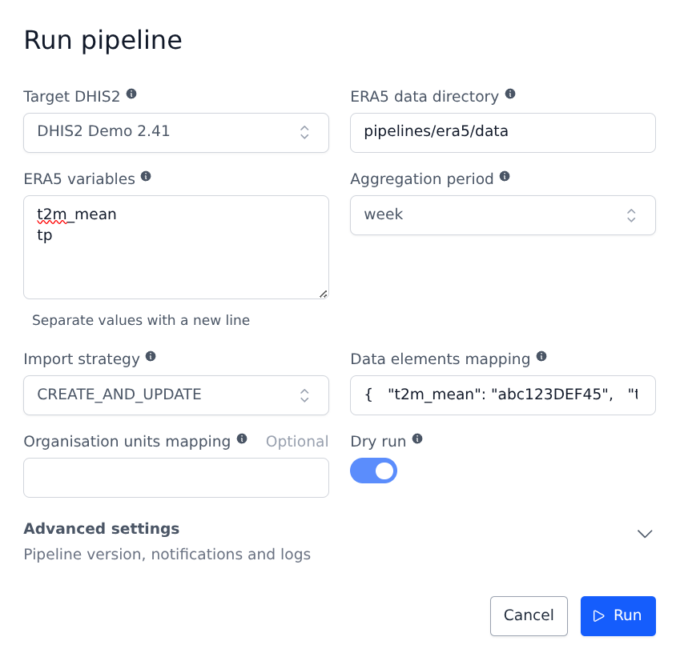
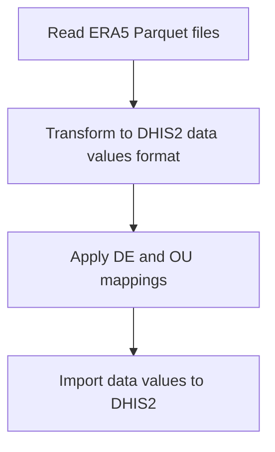

# ERA5-Land to DHIS2 Import Pipeline

This pipeline imports ERA5-Land aggregated data into a DHIS2 instance. It reads Parquet files generated by the [era5_sync](../era5_sync/README.md) pipeline and creates data values in DHIS2.

See also [ERA5 Sync](../era5_sync/) pipeline documentation for more details on supported datasets and climate variables.

- [Prerequisites](#prerequisites)
- [Parameters](#parameters)
- [Mapping files](#mapping-files)
  - [Data elements mapping](#data-elements-mapping)
  - [Organisation units mapping](#organisation-units-mapping)
- [Pipeline flow](#pipeline-flow)
- [See also](#see-also)

## Example usage



## Prerequisites

- **ERA5 Data**: Aggregated ERA5 data in Parquet format, generated by the `era5_sync` pipeline
- **DHIS2 Instance**: Target DHIS2 instance with appropriate data elements and organisation units configured
- **Mapping Files**: JSON files mapping ERA5 variables to DHIS2 data elements (and optionally boundaries to org units)

## Parameters

| Parameter | Type | Required | Default | Description |
|-----------|------|----------|---------|-------------|
| Target DHIS2 | DHIS2 Connection | Yes | - | DHIS2 instance where data values will be imported |
| ERA5 data directory | String | Yes | - | Directory with ERA5 aggregated data in Parquet format |
| ERA5 variables | List of String | Yes | - | ERA5 variables to import (e.g., `t2m_mean`, `tp`) |
| Aggregation period | String | No | `month` | Aggregation period of the data to import (`day`, `week`, `month`) |
| Import strategy | String | No | `CREATE` | DHIS2 import strategy (`CREATE_AND_UPDATE`, `CREATE`, `UPDATE`, `DELETE`) |
| Data elements mapping | String | Yes | - | Path to JSON file mapping ERA5 variables to DHIS2 data element UIDs |
| Organisation units mapping | String | No | - | Path to JSON file mapping boundary IDs to DHIS2 org unit UIDs |
| Dry run | Boolean | No | `true` | If true, simulate import without writing to DHIS2 |

## Mapping files

### Data elements mapping

Maps ERA5 variable names to DHIS2 data element UIDs:

```json
{
  "t2m_mean": "abc123DEF45",
  "t2m_min": "ghi678JKL90",
  "t2m_max": "mno234PQR56",
  "tp": "stu789VWX01"
}
```

Keys must match the variable names in the Parquet file names (e.g., `t2m_mean` for `t2m_mean_month.parquet`).

### Organisation units mapping

Maps boundary identifiers (from the ERA5 aggregation) to DHIS2 organisation unit UIDs:

```json
{
  "region1": "YZa345BCD67",
  "region2": "EFg890HIJ12",
  "region3": "KLm456NOP78"
}
```

If not provided, boundary IDs are assumed to match DHIS2 org unit UIDs directly.

## Pipeline flow



## See also

- [era5_sync pipeline](../era5_sync/README.md) - Pipeline that generates the input data
