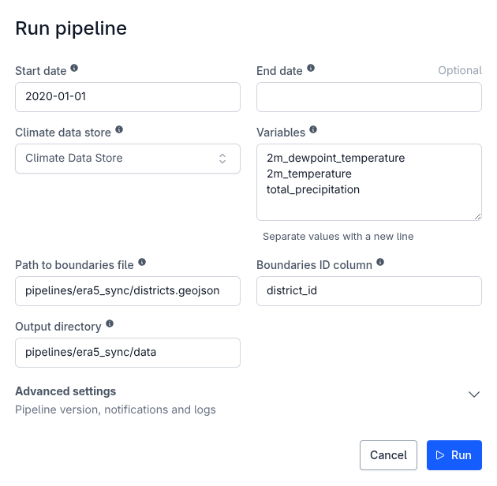
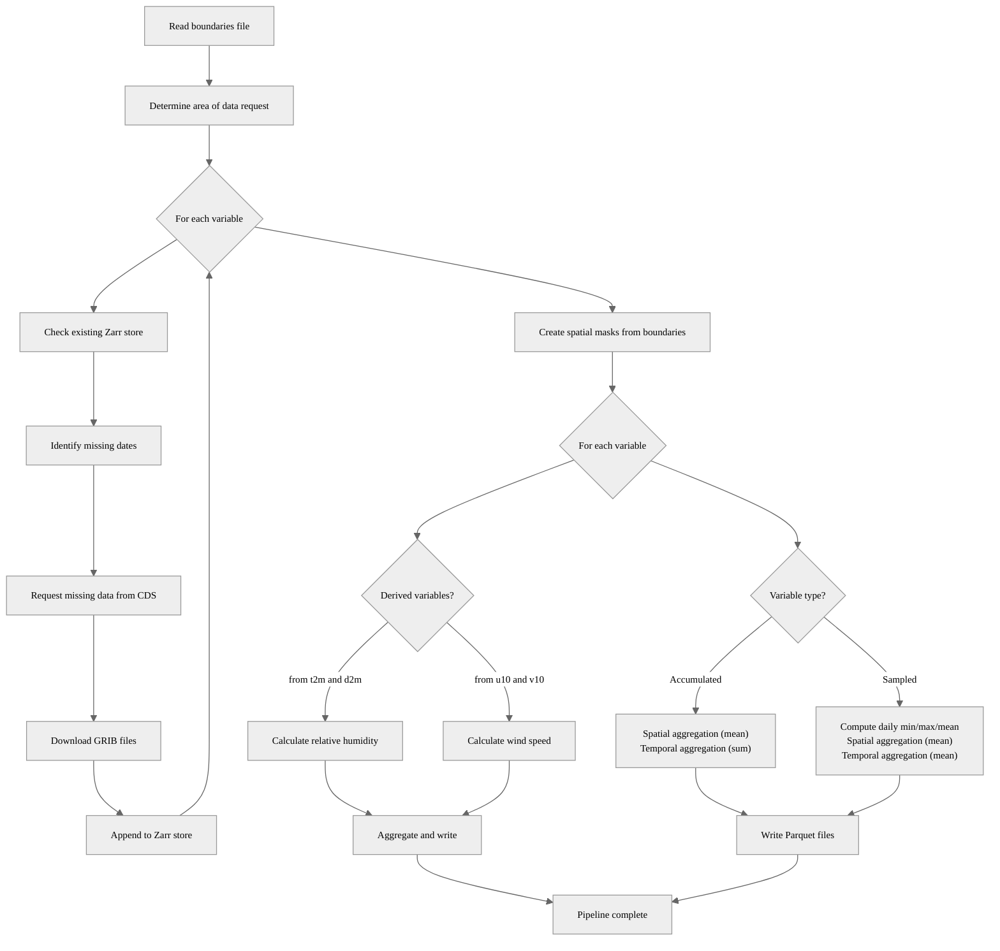

# ERA5-Land Data Synchronization Pipeline

This pipeline synchronizes ERA5-Land climate data from the Copernicus Climate Data Store (CDS) and produces spatially and temporally aggregated datasets. The pipeline:

1. **Downloads** ERA5-Land variables from the CDS API, downloading only missing data
2. **Converts** GRIB files to a Zarr store for efficient storage and access
3. **Aggregates** data spatially using custom boundaries and temporally at multiple periods (daily, weekly, monthly)
4. **Calculates** derived variables (relative humidity, wind speed) when component variables are available

The pipeline is designed to be run incrementally - subsequent runs will only download data for missing dates.

- [Example usage](#example-usage)
- [Prerequisites](#prerequisites)
- [Parameters](#parameters)
- [Supported Variables](#supported-variables)
- [Output](#output)
  - [Raw data (zarr stores)](#raw-data-zarr-stores)
  - [Aggregated data (parquet files)](#aggregated-data-parquet-files)
- [How aggregation is performed](#how-aggregation-is-performed)
  - [Spatial aggregation](#spatial-aggregation)
  - [Temporal aggregation](#temporal-aggregation)
- [Pipeline flow](#pipeline-flow)
- [Notes](#notes)
- [See also](#see-also)

## Example usage



## Prerequisites

- **CDS API Account**: You must have an account on the [Copernicus Climate Data Store](https://cds.climate.copernicus.eu/). The pipeline expects `url` and `api_key` connection parameters.
- **Dataset License**: Accept the ERA5-Land dataset license in the CDS with the aforementioned account.
- **Boundaries File**: A spatial boundaries file (GeoJSON, Geopackage, or Parquet) with geometries in EPSG:4326 (WGS84)

## Parameters

| Parameter | Type | Required | Default | Description |
|-----------|------|----------|---------|-------------|
| Start date | String | Yes | `2020-01-01` | Start date of extraction period (YYYY-MM-DD) |
| End date | String | No | Today | End date of extraction period (YYYY-MM-DD) |
| Climate data store | Custom Connection | Yes | - | CDS API credentials (with 'url' and 'api_key') |
| Variables | List of String | Yes | `2m_dewpoint_temperature`<br>`2m_temperature`<br>`total_precipitation` | ERA5-Land variables to sync |
| Path to boundaries file | String | Yes | - | Path to the boundaries file (GeoJSON, GPKG, or Parquet) |
| Boundaries ID column | String | Yes | - | Column in the boundaries file to use as identifier |
| Output directory | String | Yes | `pipelines/era5_sync/data` | Output directory for downloaded and processed data |

## Supported Variables

The pipeline supports the following ERA5-Land variables:

| Variable | Short Name | Unit | Description |
|----------|------------|------|-------------|
| `2m_temperature` | t2m | K | Air temperature at 2m above surface |
| `2m_dewpoint_temperature` | d2m | K | Dew point temperature at 2m |
| `10m_u_component_of_wind` | u10 | m s⁻¹ | Eastward wind component at 10m |
| `10m_v_component_of_wind` | v10 | m s⁻¹ | Northward wind component at 10m |
| `total_precipitation` | tp | m | Accumulated precipitation |
| `total_evaporation` | e | m | Accumulated evaporation |
| `runoff` | ro | m | Accumulated runoff |
| `soil_temperature_level_1` | stl1 | K | Soil temperature (0-7cm depth) |
| `volumetric_soil_water_layer_1` | swvl1 | m³ m⁻³ | Soil moisture (0-7cm depth) |
| `volumetric_soil_water_layer_2` | swvl2 | m³ m⁻³ | Soil moisture (7-28cm depth) |

**Derived Variables** (calculated automatically when component variables are present):
- `relative_humidity` (rh) - Calculated from `2m_temperature` and `2m_dewpoint_temperature`
- `wind_speed` (ws) - Calculated from `10m_u_component_of_wind` and `10m_v_component_of_wind`

## Output

The pipeline generates two types of outputs:

### Raw data (zarr stores)

Raw ERA5-Land data is stored in Zarr format for each variable:

```
<output_dir>/
├── 2m_temperature.zarr/
├── 2m_dewpoint_temperature.zarr/
├── total_precipitation.zarr/
└── ...
```

These stores contain the full spatiotemporal data cube (latitude, longitude, time) and are updated incrementally on subsequent runs.

### Aggregated data (parquet files)

Spatially and temporally aggregated data as Parquet files:

```
<output_dir>/
├── t2m_mean_day.parquet
├── t2m_mean_week.parquet
├── t2m_mean_month.parquet
├── t2m_min_day.parquet
├── t2m_min_week.parquet
├── t2m_min_month.parquet
├── t2m_max_day.parquet
├── t2m_max_week.parquet
├── t2m_max_month.parquet
├── tp_day.parquet
├── tp_week.parquet
├── tp_month.parquet
└── ...
```

Naming Convention:
- Sampled variables (temperature, wind, soil moisture): `{short_name}_{statistic}_{period}.parquet`
  - Statistics: `mean`, `min`, `max` (statistic used for daily aggregation)
  - Periods: `day`, `week`, `month` (period used for temporal aggregation)

- Accumulated variables (precipitation, evaporation, runoff): `{short_name}_{period}.parquet`
  - Periods: `day`, `week`, `month` (period used for temporal aggregation)

Each Parquet file contains aggregated values with the following structure:

For daily data:
```
┌──────────┬────────────┬───────────┐
│ boundary ┆ time       ┆ value     │
│ ---      ┆ ---        ┆ ---       │
│ str      ┆ date       ┆ f64       │
╞══════════╪════════════╪═══════════╡
│ region1  ┆ 2020-01-01 ┆ 298.45    │
│ region1  ┆ 2020-01-02 ┆ 299.12    │
│ region2  ┆ 2020-01-01 ┆ 297.88    │
│ ...      ┆ ...        ┆ ...       │
└──────────┴────────────┴───────────┘
```

For weekly/monthly data:
```
┌──────────┬────────────┬───────────┐
│ boundary ┆ period     ┆ value     │
│ ---      ┆ ---        ┆ ---       │
│ str      ┆ str        ┆ f64       │
╞══════════╪════════════╪═══════════╡
│ region1  ┆ 2020W1     ┆ 298.76    │
│ region1  ┆ 2020W2     ┆ 299.45    │
│ region1  ┆ 2020W3     ┆ 299.12    │
│ ...      ┆ ...        ┆ ...       │
└──────────┴────────────┴───────────┘
```

Where:
- `boundary`: Identifier from the boundaries file (value from `boundaries_id_col`)
- `time` / `period`: Date or period string
- `value`: Aggregated value in the variable's native unit

## How aggregation is performed

### Spatial aggregation

For each geometry in the boundaries file, we:
1. create a spatial mask from the boundary polygon
2. extract all ERA5 grid cells that intersect the boundary
3. calculate the mean value across all intersecting cells (area-weighted)

### Temporal aggregation

For **instantaneous variables**, we (temperature, wind, etc.), we:
1. resample hourly data to daily statistics (mean, min, max)
2. aggregate daily values to weekly/monthly means

For **accumulated variables** (precipitation, evaporation), we:
1. use accumulation values at the end of each day
2. sum daily totals to weekly/monthly totals

## Pipeline flow



## Notes

The pipeline is designed for incremental updates. On the first run, all data from `start_date` to `end_date` is downloaded. On subsequent runs, only data for new dates (not in the Zarr store) is downloaded.

The CDS API has rate limits and queue times that vary based on demand. Large data requests are automatically chunked by the pipeline to avoid overloading the server, but in some cases, large data requests might be rejected by the CDS. In such cases, consider reducing the data extraction period (especially for 1st runs).

## See also

- [ERA5-Land Dataset](https://cds.climate.copernicus.eu/datasets/reanalysis-era5-land)
- [OpenHEXA ERA5 Toolbox](https://github.com/BLSQ/openhexa-toolbox/tree/main/openhexa/toolbox/era5)
