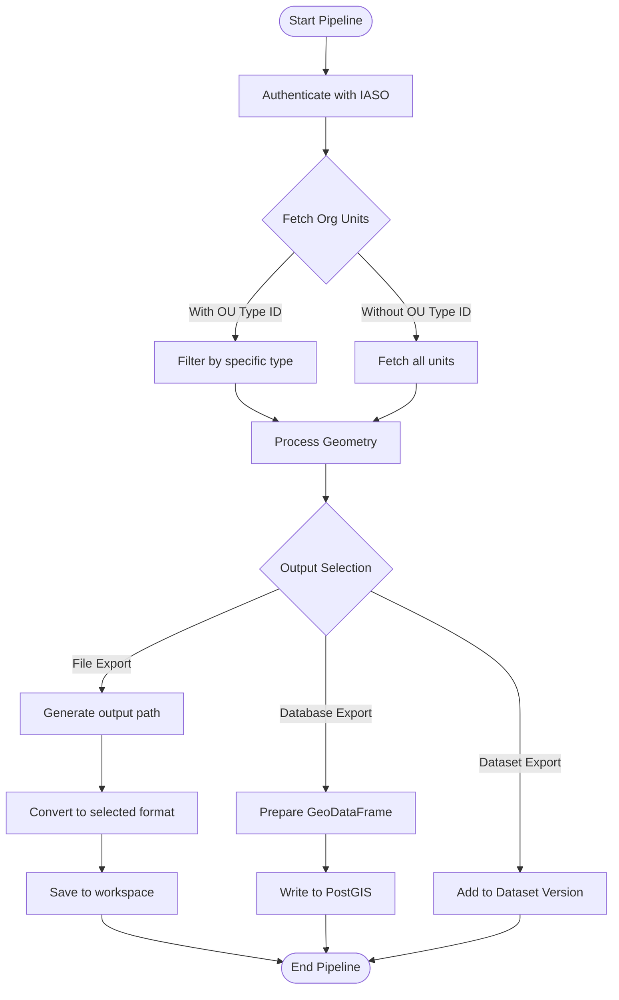

# IASO Organisation Units Extraction Pipeline

## Description

This pipeline extracts organisation units data from IASO, processes geometries, and exports to file, database, or OpenHEXA dataset.

Key features:
- Fetches organizational units (optionally filtered by type)
- Handles geometry conversion for spatial data
- Exports to multiple file formats (CSV, GeoPackage, GeoJSON, Parquet, Shapefile, TopoJSON, Excel)
- Supports PostGIS database export
- Integrates with OpenHEXA Datasets for versioned storage

## Usage Example


## Parameters

| Parameter | Type | Required | Default | Description |
|-----------|------|----------|---------|-------------|
| `iaso_connection` | IASOConnection | Yes | - | Authentication details for IASO (url, username, password) |
| `ou_type_id` | int | No | - | Specific organization unit type ID to filter results |
| `output_file_name` | str | No | - | Custom output path/filename (without extension) |
| `output_format` | str | No | `.gpkg` | Export file format (`.csv`, `.gpkg`, `.geojson`, `.parquet`, `.shp`, `.topojson`, `.xlsx`) |
| `db_table_name` | str | No | - | Target database table name |
| `save_mode` | str | No | `replace` | Database write mode (`append` or `replace`) |
| `dataset` | Dataset | No | - | Target OpenHEXA Dataset for export |

## Output

The pipeline supports three output options that can be used individually or in combination:

### 1. File Output

By default, the pipeline generates a file saved to:

```
<workspace>/iaso-pipelines/extract-orgunits/<base_name>_<YYYY-MM-DD_HH:MM>.<format>
```

Where `<base_name>` is:
- `orgunits` if no `ou_type_id` is specified
- `ou_<org_unit_type_name>` if filtering by type

For example: `ou_health_center_2024-03-15_10:30.gpkg`

Supported formats:
- `.gpkg` (default) - GeoPackage, recommended for spatial data
- `.geojson` - GeoJSON
- `.topojson` - TopoJSON (compressed topology - useful for PowerBI)
- `.shp` - ESRI Shapefile (creates multiple files: .shp, .shx, .dbf, .prj, .cpg)
- `.parquet` - GeoParquet
- `.csv` - CSV (geometry stored as GeoJSON string)
- `.xlsx` - Excel

### 2. OpenHEXA Dataset

When a `dataset` is specified, the pipeline will:
- Check if the file already exists in the latest dataset version
- Create a new version (v1, v2, v3, etc.) if new content is detected
- Upload the file(s) to the new dataset version

### 3. Database Table

When a `db_table_name` is provided, data is written to PostGIS with spatial geometry support:
- Use `save_mode: replace` to overwrite existing data (default)
- Use `save_mode: append` to add new rows

### Output Data Structure

#### Core columns

| column | type | description |
|--------|------|-------------|
| `id` | int | IASO organisation unit ID |
| `name` | str | name of the organisation unit |
| `org_unit_type` | str | type of the organisation unit |
| `source` | str | data source |
| `source_ref` | str | external reference code (e.g. DHIS2 UID) |
| `validation_status` | str | validation status in IASO |

#### Location data

| column | type | description |
|--------|------|-------------|
| `latitude` | float | latitude coordinate |
| `longitude` | float | longitude coordinate |
| `geometry` | geometry | point or polygon geometry (GeoJSON string in non-spatial formats) |

#### Temporal data

| column | type | description |
|--------|------|-------------|
| `opening_date` | date | date the org unit opened |
| `closing_date` | date | date the org unit closed |
| `created_at` | datetime | creation date in IASO |
| `updated_at` | datetime | last modification date in IASO |

#### Hierarchy columns

Parent hierarchy is included as dynamic columns depending on the org unit depth:

| column | type | description |
|--------|------|-------------|
| `level_N_name` | str | name of parent at level N (N=1,2,3...) |
| `level_N_ref` | str | external reference of parent at level N |

## Pipeline Flow


