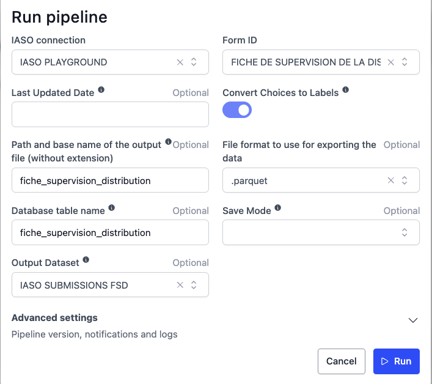
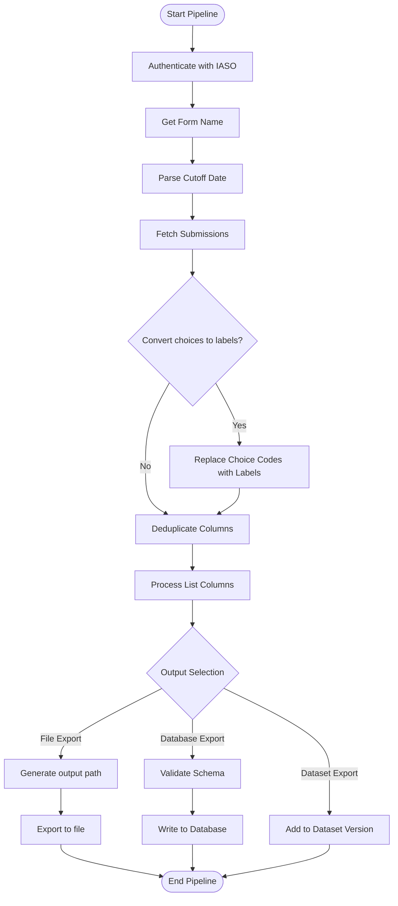

# IASO Form Submissions Extraction Pipeline

## Description

This pipeline extracts and processes form submissions data from a IASO instance. Key features:
- Authenticates with IASO using provided credentials
- Fetches form submissions (optionally filtered by last updated date)
- Converts choice codes to human-readable labels (optional)
- Processes and cleans the data (deduplicates columns, handles list-type responses)
- Exports to multiple formats (CSV, Parquet, Excel)
- Supports database export with schema validation
- Integrates with OpenHEXA Datasets for versioned data storage

## Usage Example


## Parameters

| Parameter | Type | Required | Default | Description |
|-----------|------|----------|---------|-------------|
| `iaso_connection` | IASOConnection | Yes | - |Authentication details for IASO (url, username, password) |
| `form_id` | int | Yes | - |ID of the form to extract submissions from |
| `last_updated` | str | No | - | ISO date (YYYY-MM-DD) for incremental extraction (only submissions updated after this date) |
| `choices_to_labels` | bool | No | `True` | Convert choice codes to labels |
| `output_file_name` | str | No | - | Custom output path/filename (without extension) |
| `output_format` | str | No | `.parquet` | Export file format (`.csv`, `.parquet`, `.xlsx`) |
| `db_table_name` | str | No | - | Target database table name for storage |
| `save_mode` | str | No | `replace` | Database write mode (`append` or `replace`) |
| `dataset` | Dataset | No | - | Target OpenHEXA Dataset for export |

## Output

The pipeline supports three output options that can be used individually or in combination:

### 1. File Output

By default, the pipeline generates a file containing the extracted form submissions. The file is saved to:

```
<workspace>/iaso-pipelines/extract-submissions/<form_name>_<YYYY-MM-DD_HH:MM>.<format>
```

For example: `household_survey_2024-03-15_10:30.parquet`

You can specify a custom output path using the `output_file_name` parameter.

Supported formats:
- `.parquet` (default)
- `.csv`
- `.xlsx`

### 2. OpenHEXA Dataset

When a `dataset` is specified, the pipeline will:
- Check if the data file already exists in the latest dataset version
- Create a new version (v1, v2, v3, etc.) if new content is detected
- Upload the submissions data file to the new dataset version

### 3. Database Table

When a `db_table_name` is provided, the extracted data will be written to the workspace database:
- Use `save_mode: replace` to overwrite existing data (default)
- Use `save_mode: append` to add new rows to an existing table

### Output Data Structure

The output includes form submission data with the following structure:

- Form field columns: All form fields are included as columns (e.g., `respondent_name`, `respondent_age`, etc.). Data types depend on the form field type.
- System columns: Metadata about each submission
- Location data: GPS coordinates if captured
- Organisation unit info: Associated org unit details

#### System columns

| column | type | description |
|--------|------|-------------|
| `id` | int | unique submission identifier in IASO |
| `instanceid` | str | UUID of the submission instance in IASO |
| `created_at` | str | submission creation date |
| `updated_at` | str | last update date |
| `form_version` | str | version ID of the form |

#### Location data

| column | type | description |
|--------|------|-------------|
| `latitude` | float | GPS latitude coordinate |
| `longitude` | float | GPS longitude coordinate |

#### Organisation unit details

| column | type | description |
|--------|------|-------------|
| `org_unit_id` | int | IASO organisation unit identifier |
| `org_unit_name` | str | name of the organisation unit |
| `org_unit_ref` | str | external reference code of the organisation unit |

List-type fields (multi-select questions) are automatically expanded into binary columns (one column per option).

```
┌──────────┬──────────┬─────────────────────────────┬─────────────────────────────┬──────────────┬────────┬───────────┬────────────┬─────────────────────────────────────────┬─────────────┬───────────────┬──────────────┐
│ field_1  ┆ field_2  ┆ created_at                  ┆ updated_at                  ┆ form_version ┆ id     ┆ latitude  ┆ longitude  ┆ instanceid                              ┆ org_unit_id ┆ org_unit_name ┆ org_unit_ref │
│ ---      ┆ ---      ┆ ---                         ┆ ---                         ┆ ---          ┆ ---    ┆ ---       ┆ ---        ┆ ---                                     ┆ ---         ┆ ---           ┆ ---          │
│ i64      ┆ str      ┆ str                         ┆ str                         ┆ str          ┆ i64    ┆ f64       ┆ f64        ┆ str                                     ┆ i64         ┆ str           ┆ str          │
╞══════════╪══════════╪═════════════════════════════╪═════════════════════════════╪══════════════╪════════╪═══════════╪════════════╪═════════════════════════════════════════╪═════════════╪═══════════════╪══════════════╡
│ 5        ┆ Option A ┆ 2024-03-15T10:30:00.000000  ┆ 2024-03-15T10:35:00.000000  ┆ 2024031501   ┆ 123456 ┆ 5.3271    ┆ -4.0018    ┆ uuid:a1b2c3d4-e5f6-7890-abcd-ef12345678 ┆ 1234567     ┆ Health Center ┆ ABC123XYZ    │
│ 3        ┆ Option B ┆ 2024-03-15T11:00:00.000000  ┆ 2024-03-15T11:05:00.000000  ┆ 2024031501   ┆ 123457 ┆ 6.8113    ┆ -5.1374    ┆ uuid:b2c3d4e5-f6a7-8901-bcde-f234567890 ┆ 1234568     ┆ District Hosp ┆ DEF456UVW    │
│ …        ┆ …        ┆ …                           ┆ …                           ┆ …            ┆ …      ┆ …         ┆ …          ┆ …                                       ┆ …           ┆ …             ┆ …            │
└──────────┴──────────┴─────────────────────────────┴─────────────────────────────┴──────────────┴────────┴───────────┴────────────┴─────────────────────────────────────────┴─────────────┴───────────────┴──────────────┘
```

The actual columns depend on the form structure. `field_1`, `field_2`, etc. represent form-specific fields.

## Pipeline Flow

