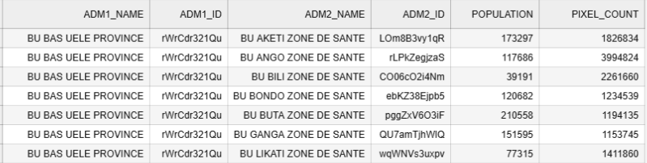

# WorldPop Extract Population Pipeline

This pipeline (`wpop_extract_population`) extracts and aggregates population data from **WorldPop** raster files (.tif) into spatial units defined by a given boundaries file.  

---

## Parameters

| Parameter          | Type  | Required | Description |
|--------------------|-------|----------|-------------|
| `Country ISO3 code`| str   | ✅       | 3-letter ISO code of the country (e.g., `COD`, `BFA`). Determines which WorldPop raster to download. |
| `UN adjusted pop.` | bool  | ✅       | If `true`, downloads **UN-adjusted** WorldPop grid data. If `false`, uses the original WorldPop data. |
| `Boundaries file`  | File  | ✅       | Path to the boundaries file that defines the spatial aggregation units. Supported formats: `.geojson`, `.shp`, `.gpkg` (see [geopandas.read_file](https://geopandas.org/en/stable/docs/reference/api/geopandas.read_file.html)). |
| `Output directory` | str   | ❌       | Output directory inside the OH workspace. Parent directory will be created if missing. |
| `Output DB table`  | str   | ❌       | Name of the output table in the database. If provided, the aggregated results will be stored in the database. |

---

### CRS Handling  

- If the boundaries file has **no CRS**, it is set to **EPSG:4326 (WGS84)**.  
- If the CRS differs from the WorldPop raster, the boundaries are **reprojected to match the raster CRS**.  

This ensures proper alignment between the raster and the boundaries for spatial aggregation. 

---

## Outputs

1. **Raw Data**
   - WorldPop `.tif` raster file is automatically downloaded to:
     ```
     wpop_extract_population/data/raw/
     ```
   - File name depends on the country ISO code and year.

2. **Aggregated Data**
   - A CSV/Parquet file saved to the specified `Output directory`.
   - If `Output directory` is **not provided**, the files are saved by default under:
     ```
     pipelines/wpop_extract_population/data/aggregated/
     ```
   - If `Output DB table` is provided, results are also written to a database table.
   - Example of aggregated data output:



---

## Flow Diagram

```mermaid
flowchart TD
    A[Start Pipeline] --> B[Download WorldPop raster .tif]
    B --> C{un_adj ?}
    C -- Yes --> B1[Download UN-adjusted raster]
    C -- No --> B2[Download non-adjusted raster]
    B1 --> D[Load boundaries file]
    B2 --> D[Load boundaries file]
    D --> E[Aggregate population by boundaries]
    E --> F[Save results to dst_dir]
    F --> G{dst_table provided?}
    G -- Yes --> H[Write results to DB table]
    G -- No --> I[Skip DB storage]
    H --> J[End]
    I --> J[End]
